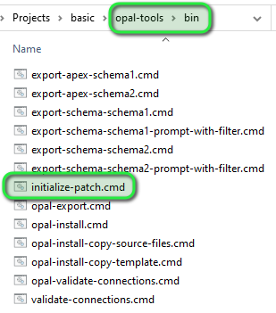
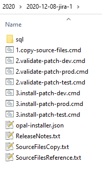
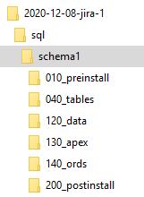
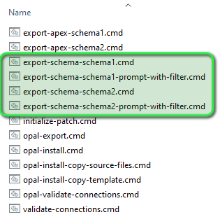
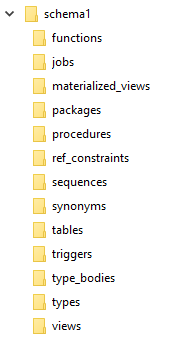

* [What are the OPAL Tools?](#what-are-the-opal-tools)
* [Youtube Demo Videos](#youtube-demo-videos)
* [Download and Setup](#download-and-setup)
* [Quickstart opal-install](#quickstart-opal-install)
* [Quickstart opal-export](#quickstart-opal-export)
* [Advanced Customization](#advanced-customization)
* [Troubleshooting](#troubleshooting)
* [Licenses](#licenses)

# What are the OPAL Tools?

### The Problem

Do you have an approach to move your Oracle code changes (PL/SQL, APEX, ORDS) from your development environment to test and production? Or are you unhappy with your existing one, get errors during installation, miss changes that were not deployed or don't know when you deployed the changes into which environment? 

### Benefits

* Automate your typically manual process of running sql scripts in the desired order
* Don't manually code your release - configure it
* Automatic log generation in logfiles and database tables
* Comes with sound and proven default settings (used in actual client projects since Oct/2019)
* Highly adaptable through configuration files and command line switches, you are *not stuck* with our way of doing things
* Getting started is easy, shell scripts are pregenerated during setup, only need to be customized
* No separate tools / installation required, Oracle SQLcl libraries are embedded in the download. This way exporting Oracle APEX and Oracle ORDS applications is possible without additional software, e.g. the ``APEXExport.class``.

### How does it work?

The software is written in Java and leverages Oracle SQLcl and ``DBMS_METADATA``. Actuall, it embeds the libraries of SQLcl so that no additional software is required (only Java8+). The real magic happens through the generated batch scripts that leverage these command-line tools. It works nicely with Git / Subversion and supports working from the file system, from the DB or a mix of both. 

* opal-install

The installer uses SQLcl under the hood to actually run the SQL scripts. The core engine is very simple. It will execute SQL files which it finds by iterating through the filesystem and listing all files that exist. 

It uses regular expressions in order to figure out a mapping between a file system path and the matching connection pool. 
It can be configured in multiple ways so that there is no requirement for a specific layout of the filesystem. 

* opal-export

The exporter uses SQLcl together with ``DBMS_METADATA`` to export Oracle database objects, APEX applications, ORDS REST modules and everything as files into the filesystem. 

This enables you to support different workflows: 
* use it only once at the beginning to create a baseline of files, then only make all future changes through those files under version control. 
* make changes in the database and spool it into the filesystem for deployment continously

### OS support

It should work for most operating systems, it was tested on Windows, MacOS and Linux. 

# Youtube Demo Videos

* In this video you can see a short description and a longer demo on how to actually use the project, understand the possible workflows and how to set it up: https://youtu.be/gdudGocohpk.
* Here is a fun interview with Jürgen Schuster for the **APEX World for Dummies series**: https://www.youtube.com/watch?v=YkVbXfF5hZI&list=PL3S33P01ea06WdgNtuFvGd-f8PvP54-g0&index=1

# Download and Setup

The binary files can be downloaded here: [https://github.com/daust/opal-installer/releases](https://github.com/daust/opal-installer/releases). This is the easiest way to use the opal-tools. The SQLcl libraries are already included in the binary distribution. 

You can also ``git clone`` this repository. In order to create the binary release yourself, please follow the instructions for [developers](src/doc/Developers.md).

Once downloaded and unzipped you run the command ``setup.sh`` or ``setup.cmd``. This will copy and customize the appropriate files. 

# Quickstart opal-install

## Initialize a new patch

By starting the script ``opal-tools/bin/initialize-patch.cmd`` (on Windows you can just double-click it), you will be prompted for a patch name. 



The ``patch-template`` folder will be copied to the new location: ``patches/<year>/<yyyy-mm-dd-<patch name>>``. 
The new location is defined in the script ``opal-tools/bin/initialize-patch`` and can be customized to your liking. 



Next, configure the ``opal-installer.json`` file for your current patch. 
Typically, for each patch you enter the application name, the patch name and the version. If you want to make a change that is permanent for all future patches, you can even modify the patch template, then it will be picked up next time you initialize a new patch. 

## Put your files you want to install into the sql-directory

You can freely create a subdirectory structure under ``sql/<schema name>`` and put in all files you want to install. When you click on ``3.install-patch-<environment>.cmd``, those files will be executed using the embedded SQLcl engine and use the connection pools defined during setup. 



## Copy files from the source directory to the patch directory

The file ``1.copy-source-files.cmd`` is configured to copy files from the source directory ``sql`` to the target directory ``<patch name>/sql``. In the file ``SourceFilesCopy.conf`` you only configure, which files you want to have copied, e.g.: 
<pre style="overflow-x: auto; white-space: pre-wrap; white-space: -moz-pre-wrap; white-space: -pre-wrap; white-space: -o-pre-wrap; word-wrap: break-word;">
# Tables
schema1/tables => schema1/040_tables
<b>xlib*.sql</b>
</pre>

Only tables (i.e. files) which match the wildcard ``xlib*.sql`` will be copied to the target directory ``<patch name>/sql/schema1/040_tables``. 

## Execute the patch

By starting the script ``3.install-<environment>.cmd|sh`` (on Windows you can just double-click it), the patch will be installed in the target environment. 

# Quickstart opal-export

## Export database objects to the filesystem

You can export database objects into the filesystem using the scripts ``export-schema-<schema name>.cmd`` and ``export-schema-<schema name>-prompt-with-filter.cmd``.



This will spool the files into the SQL source tree based on their object type. Then you can also copy them from there to the patch directory using ``1.copy-source-files.cmd`` and ``SourceFilesCopy.conf``.



## Export Oracle APEX and Oracle ORDS applications to the filesystem

You can export Oracle APEX and Oracle ORDS applications into the filesystem using the scripts ``opal-tools/bin/export-apex-<schema name>.cmd``.

By default, it will call the script ``opal-tools/export-scripts/opal-export-post-script.sql``. There are examples for APEX and ORDS that you can use (it uses SQLcl functionality): 
```
-- Sample APEX export
apex export -applicationid 344
apex export -applicationid 201

-- Sample ORDS export
spool my_rest_modules_export.sql
rest export
prompt /
spool off
```

# Advanced Customization

The solution can be customized to suit your needs. You can find more information [here](src/doc/Customization.md).

It is best to start with the patch template. Modify the shell scripts you find there. Remove the ones that you don't need, add elements to the ``sql`` folder structure that you would need in all patches. Also, look at the command line switches in the shell scripts and adapt them to suit your needs.

In the beginning, the logging in the database tables is disabled. Check the documentation on [how to activate it](src/doc/Customization.md#database-log-tables). 

Here is an overview of SQLcl commands that you can use: https://docs.oracle.com/en/database/oracle/sql-developer-command-line/20.3/sqcug/working-sqlcl.html. 

When running a standalone SQLcl client you can get more help, especially on the APEX and ORDS commands: 
```
help apex
apex export
help rest
```

# Troubleshooting

Information on troubleshooting can be found [here](src/doc/Troubleshooting.md).

# Licenses

The software of this project uses the "BSD 3-Clause" license, [see here for details](https://github.com/daust/opal-tools/blob/master/LICENSE). 

Nevertheless, we are embedding software from Oracle: Oracle JDBC drivers and Oracle [SQLcl](https://www.oracle.com/de/database/technologies/appdev/sqlcl.html). 

In order to use the Oracle software, you have adhere to the [license agreement by Oracle](https://www.oracle.com/downloads/licenses/oracle-free-license.html). 
A local copy of this license agreement [can be found here](src/doc/Oracle-free-license.md). 
