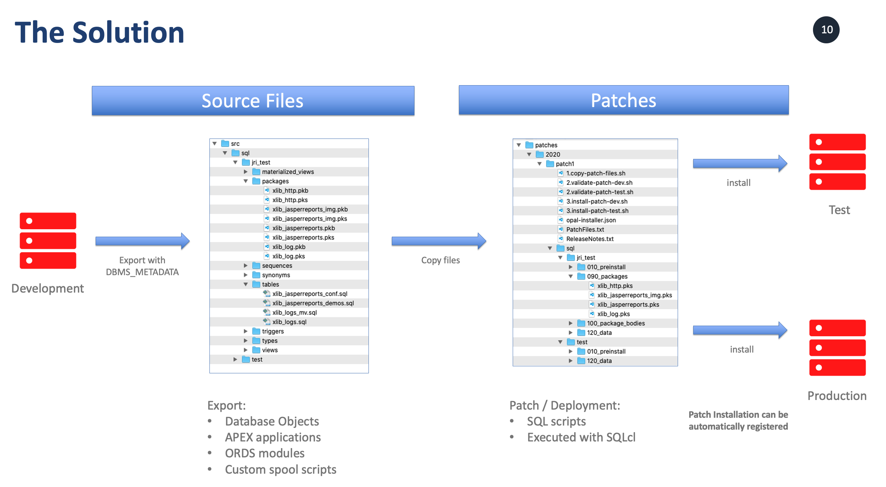

* [What are the OPAL Tools?](#what-are-the-opal-tools)
* [Download](#download)
* [Setup](#setup)
* [opal-exporter](#opal-exporter)
* [opal-installer](#opal-installer)
* [Usage](#usage)
* [Configuration](#configuration)
* [Special use cases](#special-use-cases)
* [Troubleshooting](#troubleshooting)

# What are the OPAL Tools?

This is a set of small and flexible Java applications together with generated batch scripts. Using them you can simplify and speed up your development and deployment of Oracle SQL, PL/SQL, Oracle APEX and Oracle ORDS applications significantly. 

Because almost every developer prefers a different approach, these tools are very adaptable by design. 

In order to be highly effective, I always wanted to have an out-of-the-box solution that I can use in every project and become productive right away. 

Since there was none ... this project was created. These tools are most powerful when used together ... but you can choose to use either one and ignore the other. 



## The exporter

The exporter uses SQLcl together with DBMS_METADATA to export Oracle database objects, APEX applications, ORDS REST modules and everything that you can do in a SQLcl script file. 

This will export the current definition of a database object and store it in the filesystem. This can be done at the beginning when you start using this approach or all the time whenever you want to export a single or multiple objects. 

You can choose to work directly in the database, purely from the filesystem ... or something in between ... it is your choice. 

## The installer

The installer uses SQLcl under the hood to actually run the SQL scripts. The core engine is very simple. It will execute SQL files which it finds in the filesystem. 

It uses regular expressions in order to figure out a mapping between a file system path and the matching connection pool. 

It can be configured in multiple ways so that there is no requirement for a specific layout of the filesystem. 

## OS support

It should work for most operating systems, I have tested it on Windows, MacOS and Linux. 

# Download

The files can be downloaded here: [https://github.com/daust/opal-installer/releases](https://github.com/daust/opal-installer/releases).

# Setup

Once downloaded and unzipped you run the command ``setup.sh`` or ``setup.cmd``. This will copy and customize the appropriate files. 

During the setup process you will be prompted to enter specific file locations (directories) so that you can fully customize the environment. For starters it is recommended to use the defaults and get familiar with it. 

The setup command comes with command line options, the minimum parameter is ``--project-root-dir``, but you can pass almost all parameters on the command line: 

```
 -s (--show-passwords)                             : when prompted for passwords, they will be shown in clear text (Vorgabe:
                                                     false)
 -h (--help)                                       : display this help page (Vorgabe: false)
 --project-root-dir <directory>                    : Sets the root directory for the installation. Will be used to derive other
                                                     parameters if not set explicitly. This directory is typically the target of
                                                     a GIT or SVN export.
 --software-dir <directory>                        : SW install directory (contains bin and lib directories)
                                                     e.g. ${PROJECT_ROOT}/opal-tools or %PROJECT_ROOT%\opal-tools 
 --template-dir <directory>                        : Patch template directory
                                                     e.g. ${PROJECT_ROOT}/patch-template or %PROJECT_ROOT%\patch-template
 --local-config-dir <directory>                    : Local configuration directory (connection pools, user dependent config),
                                                     typically OUTSIDE of the git tree
                                                     e.g. /local/conf-user or c:\local\conf-user
 --environment-script <directory>                  : Local script to initialize the user environment for this project
                                                     e.g. /local/conf-user/setProjectEnvironment.sh or
                                                     c:\local\conf-user\setProjectEnvironment.cmd
 --db-source-dir <directory>                       : Database source directory (sql, has subdirectories e.g.
                                                     sql/oracle_schema/tables, sql/oracle_schema/packages, etc.)
                                                     e.g. ${PROJECT_ROOT}/src/sql or %PROJECT_ROOT%\src\sql
 --patch-dir <directory>                           : Patch directory (patches, has subdirectories e.g. year/patch_name)
                                                     e.g. ${PROJECT_ROOT}/patches or %PROJECT_ROOT%\patches
 --schemas schema1 [schema2] [schema3] ...         : List of database schemas (blank-separated, e.g. hr scott)
                                                     e.g. schema1 schema2
 --environments env1 [env2] [env3]...              : List of environments (blank-separated, e.g. dev test prod)
                                                     e.g. dev test prod
 --environment-colors color1 [color2] [color3] ... : List of shell colors for the environments (blank-separated, e.g. green
                                                     yellow red)
                                                     e.g. green yellow red: 
 --export-environment environment                  : Which is your designated developement environment? This is used for the
                                                     export.
                                                     e.g. dev
 --file-encoding file encoding                     : file encoding (e.g. UTF-8 or Cp1252, default is current system encoding)
                                                     e.g. UTF-8
```

The prompts are (defaults are shown in brackets [] and accepted by just pressing ``<enter>``): 

* ``Project root directory, typically the target of a GIT or SVN export``: 
    - In most cases you will use a central directory and all files for this project will be stored in subdirectories. 
    - Also, when using subversion, GIT or a similar tool you might have multiple exports of the same project in different locations. 
    - This directory will be set up as an environment variable and can be used for subsequent prompts, e.g. ${PROJECT_ROOT} or %PROJECT_ROOT%.
* ``SW install directory (contains bin and lib directories) [${PROJECT_ROOT}/opal-tools]``: 
    - Here we will install the actual software itself and create the subdirectories bin, conf and lib.
* ``Patch template directory [${PROJECT_ROOT}/patch-template]: ``: 
    - This directory and all files in it will be copied into a new patch. 
* ``Local configuration directory (connection pools, user dependent config)``: 
    - Here the installer will find the connection pools for this user environment. 
    - Typically, this is NOT part of the SVN or GIT repository because it contains passwords and also might be different for each user. 
* ``Local script to initialize the user environment for this project``: 
    - This script will include all locations and store them in variables. Only those variables are used in the generated scripts. 
    - Thus, all you need to change is the contents of this file. 
    - When you are developing with multiple developer you can : 
        - choose to store this file ON EACH developer machine in the same location, then you enter a fully qualified path, e.g.: ``c:\local-config\setProjectEnvironment.cmd``
        - choose to change the %PATH% variable and add this script to the path, then you enter the script name without any path, e.g. ``setProjectEnvironment.cmd``
* ``Database source directory (sql, has subdirectories e.g. sql/oracle_schema/tables, sql/oracle_schema/packages, etc.) [${PROJECT_ROOT}/sql]``:
    - in this directory you will store the sources for the project
* ``Patch directory (patches, has subdirectories e.g. year/patch_name) [${PROJECT_ROOT}/patches]``:
    - in this directory we will generate the new patch directories. The default layout is ``patches\<year>\<year-month-day>-<patch name>``, it can be changed in the file ``bin\initializePatch.cmd``
* ``List of database schemas (blank-separated, e.g. hr scott) [hr scott]``:
    - how many different schemas do we want to install into? 
    - This comma separated list will be used to generate the connection pool files. 
* ``List of environments (blank-separated, e.g. dev test prod) [dev test prod]``:
    - how many different environments do we want to install into? 
    - This comma separated list will be used to generate the connection pool files. 
* ``List of shell colors for the environments (blank-separated, e.g. green yellow red) [green yellow red]``:
    - The generated batch scripts for each environment can take on different foreground colors. 
    - This makes installing into a test environment (yellow) or production environment (red) more obvious.
* ``Which is your developement environment? This is used for the export:  [dev]``:
    - The designated development enviroment will be used in the export scripts as the source database connection.
* ``file encoding (e.g. UTF-8 or Cp1252, default is current system encoding):``:
    - The file encoding can be become very critical when using special characters like the German umlauts or others. 
    - This setting will be used to generate ``-Dfile.encoding=`` settings for the Java command lines. 
    - The APEX export tools will always generate UTF-8 encoded files. 
    - During installation the default from the operation system is picked up, this is for example UTF-8 on MacOS and Cp1252 on Windows. 

## Running the setup on Windows
```
setup.cmd --project-root-dir <project root directory>
e.g.
setup.cmd --project-root-dir c:\Projects\project1
```

## Running the setup on MacOS / Linux: 
```
setup.sh --project-root-dir <project root directory>
e.g.
setup.sh --project-root-dir /u01/project1
```

## Setup example for Windows

In this example we will start the ``setup.cmd`` script with the parameter ``c:\Projects\project1``, this will be used as the default directory and most others will be relative to this one. 
The generated file locations are ONLY suggestions, you can change all of them. 

When using ``<ENTER>`` you will accept the default which is specified in brackets, e.g.: ``[c:\Projects\project1]``. 

In this sample we will:
- use ``c:\Projects\project1`` as the project root,
- store the installation files in 
    - ``c:\Projects\project1\opal-installer\bin``
    - ``c:\Projects\project1\opal-installer\conf``
    - ``c:\Projects\project1\opal-installer\lib``
- store the patch-template files in 
    - ``c:\Projects\project1\patch-template``
- store the local user configuration files in 
    - ``c:\conf-user``
- store the generated patches in 
    - ``c:\Projects\project1\patches``
    - ``c:\Projects\project1\patches\<year>\<year-month-day>-<patch name>``
        - e.g.: ``c:\Projects\project1\patches\2020\2020-10-29-test``
- use one connection pool named ``jri_test``
- install on two environments named ``dev`` and ``test`` with the respective connection pool files (each one having a definition for ``jri_test``)

<pre style="overflow-x: auto; white-space: pre-wrap; white-space: -moz-pre-wrap; white-space: -pre-wrap; white-space: -o-pre-wrap; word-wrap: break-word;">
c:\Projects\opal-tools-2.2.0-sqlcl-20.3.0><b>setup.cmd -s --project-root-dir "c:\Projects\project1"</b>

Project root directory, typically the target of a GIT or SVN export: c:\Projects\project1
SW install directory (contains bin and lib directories) [%PROJECT_ROOT%\opal-tools]:
Patch template directory [%PROJECT_ROOT%\patch-template]:
Local configuration directory (connection pools, user dependent config) [c:\Projects\project1\conf-user]: <b>c:\conf-user</b>
Local script to initialize the user environment for this project [c:\conf-user\setProjectEnvironment.cmd]: <b>c:\conf-user\setProject1.cmd</b>
Database source directory (sql, has subdirectories e.g. sql/oracle_schema/tables, sql/oracle_schema/packages, etc.) [%PROJECT_ROOT%\sql]:
Patch directory (patches, has subdirectories e.g. year/patch_name) [%PROJECT_ROOT%\patches]:
List of database schemas (blank-separated, e.g. hr scott) [hr scott]: <b>jri_test</b>
List of environments (blank-separated, e.g. dev test prod) [dev test prod]: <b>dev test</b>
List of shell colors for the environments (blank-separated, e.g. green yellow red) [green yellow red]: <b>green yellow</b>
Which is your developement environment? This is used for the export:  [dev]:
file encoding (e.g. UTF-8 or Cp1252, default is current system encoding):  [Cp1252]:

*** Installation Summary:

Project root directory, typically the target of a GIT or SVN export: c:\Projects\project1
SW install directory (contains bin and lib directories): %PROJECT_ROOT%\opal-tools
Patch template directory: %PROJECT_ROOT%\patch-template
Local configuration directory: c:\conf-user
Local script to initialize the user environment for this project: c:\conf-user\setProject1.cmd
Database source directory: %PROJECT_ROOT%\sql
Patch directory: %PROJECT_ROOT%\patches
List of database schemas: jri_test
List of environments: dev test
List of shell colors: green yellow
Environment export connection: dev
File encoding: Cp1252

***

Please press <enter> to proceed ...

process local conf directory in: C:\conf-user

  Process environment: dev => C:\conf-user\connections-dev.json
    JDBC url for environment dev (hostname:port:sid or hostname:port/servicename):  [127.0.0.1:1521:xe]:

    User to connect to schema jri_test in environment dev:  [jri_test]:
    Password :  []: 

  Process environment: test => C:\conf-user\connections-test.json
    JDBC url for environment test (hostname:port:sid or hostname:port/servicename):  [127.0.0.1:1521:xe]:

    User to connect to schema jri_test in environment test:  [jri_test]:
    Password :  []: 

----------------------------------------------------------
copy sw files from: C:\Projects\opal-tools-2.2.0-sqlcl-20.3.0\lib
              to  : C:\Projects\project1\opal-tools\lib
----------------------------------------------------------
copy sw files from: C:\Projects\opal-tools-2.2.0-sqlcl-20.3.0\configure-templates\export-scripts
              to  : C:\Projects\project1\opal-tools\export-scripts
----------------------------------------------------------
copy sw files from: C:\Projects\opal-tools-2.2.0-sqlcl-20.3.0\configure-templates\export-templates
              to  : C:\Projects\project1\opal-tools\export-templates
----------------------------------------------------------
copy sw files from :C:\Projects\opal-tools-2.2.0-sqlcl-20.3.0\conf
              to  : C:\Projects\project1\opal-tools\conf

copy template directory from: C:\Projects\opal-tools-2.2.0-sqlcl-20.3.0\configure-templates\patch-template
                        to  : C:\Projects\project1\patch-template

  process file 1.copy-patch-files.cmd
  process file 2.validate-patch-#ENV#.cmd
  process file 3.install-patch-#ENV#.cmd
  process file opal-installer.json
  process file PatchFiles-body.txt
  process file PatchFiles-header.txt
  process file ReleaseNotes.txt

db source directory from: C:\Projects\opal-tools-2.2.0-sqlcl-20.3.0\configure-templates\src-sql
                    to  : %PROJECT_ROOT%\sql

patch directory from: c:\Projects\opal-tools-2.2.0-sqlcl-20.3.0\patches
                to  : C:\Projects\project1\patches

process bin directory

  process file export-apex-#SCHEMA#.cmd
  process file export-schema-#SCHEMA#-prompt-with-filter.cmd
  process file export-schema-#SCHEMA#.cmd
  process file initialize-patch.cmd
  process file opal-export.cmd
  process file opal-install-copy-patch-files.cmd
  process file opal-install-copy-template.cmd
  process file opal-install.cmd
  process file opal-validate-connections.cmd
  process file validate-connections.cmd

Open PROJECT_ROOT: c:\Projects\project1...
</pre>

All environment variables are set up in the "Local script to initialize the user environment", e.g.: ``c:\opal-installer-local\setProjectEnvironment-project1.cmd``: 

<pre style="overflow-x: auto; white-space: pre-wrap; white-space: -moz-pre-wrap; white-space: -pre-wrap; white-space: -o-pre-wrap; word-wrap: break-word;">
@REM DEBUG: For debugging, you can turn on ECHO again ... and also OPAL_TOOLS_JAVA_ARGS below
@echo OFF

@REM --------------------------------------------------------------------------
@REM User specific configuration
@REM --------------------------------------------------------------------------
set PROJECT_ROOT=c:\Projects\project1
set OPAL_TOOLS_USER_IDENTITY=Administrator

@REM --- change if needed ---
@REM set ORACLE_HOME=c:\Progs\Oracle\Client\12.1\Home
@REM it MUST be a JDK, a JRE is NOT ENOUGH
@REM set JAVA_HOME=c:\Program Files (x86)\Java\jdk1.8.0_251

@REM --------------------------------------------------------------------------
@REM General configuration settings, typically unchanged
@REM --------------------------------------------------------------------------
set OPAL_TOOLS_HOME_DIR=%PROJECT_ROOT%\opal-tools
set OPAL_TOOLS_JAVA_ARGS=-Dlog4j.configurationFile="%OPAL_TOOLS_HOME_DIR%\conf\log4j2.xml" -Djava.util.logging.config.file="%OPAL_TOOLS_HOME_DIR%\conf\log4j.properties" -Dfile.encoding=Cp1252

@REM DEBUG: for debugging, use these log file settings
@REM set OPAL_TOOLS_JAVA_ARGS=-Dlog4j.configurationFile="%OPAL_TOOLS_HOME_DIR%\conf\log4j2-debug.xml" -Djava.util.logging.config.file="%OPAL_TOOLS_HOME_DIR%\conf\log4j-debug.properties" -Dfile.encoding=Cp1252

set OPAL_TOOLS_USER_CONFIG_DIR=c:\conf-user
set OPAL_TOOLS_SRC_SQL_DIR=%PROJECT_ROOT%\sql
set OPAL_TOOLS_PATCH_TEMPLATE_DIR=%PROJECT_ROOT%\patch-template
set OPAL_TOOLS_PATCH_DIR=%PROJECT_ROOT%\patches

@REM --- typically unchanged ---
@REM Date Strings to be used in scripts
@REM DATE_STRING=YYYY-MM-DD
@REM YEAR=YYYY

FOR /f %%a in ('WMIC OS GET LocalDateTime ^| find "."') DO set DTS=%%a
set DATE_STRING=%DTS:~0,4%-%DTS:~4,2%-%DTS:~6,2%
set YEAR=%DTS:~0,4%
@REM echo DATE_STRING: %DATE_STRING%
@REM echo YEAR: %YEAR%

set PATH=%OPAL_TOOLS_HOME_DIR%\bin;%PATH%

</pre>


# opal-exporter

The exporter comes with a specific setup that will work in many cases. If you have other requirements, here is a description of the command line switches that you can use: 

```
 -h (--help)                                                : show this help page (Vorgabe: false)
 -v (--version)                                             : show version information (Vorgabe: false)
 --url <jdbc url>                                           : database connection jdbc url,
                                                              e.g.: scott/tiger@localhost:1521:ORCL
 --connection-pool-file <file>                              : connection pool file
                                                              e.g.: connections-dev.json
 --connection-pool-name <connection pool name>              : connection pool name
                                                              e.g.: scott
 --output-dir <directory>                                   : output directory, e.g. '.' or '/u01/project/src/sql'
 --includes <filter1> [<filter2>] ... [n]                   : include filter, e.g.: %XLIB% or *XLIB*
 --include-types <type1> [<type2>] ... [n]                  : include types, e.g.: TABLE PACKAGE
 --excludes <type1> [<type2>] ... [n]                       : exclude filter, e.g.: %AQ$% %SYS_% or
 --exclude-types <type1> [<type2>] ... [n]                  : exclude types, e.g.: JOB
 --include-schemas <schema1> [<schema2>] ... [n]            : schemas to be included, only relevant when connecting as DBA
 --escape-char <escape character>                           : add escape() clause to like queries for selecting objects, e.g. \
                                                              or ~
 --dependent-objects <type>:<deptype1>,<deptype2> ... [n]   : dependent objects, e.g. TABLE:COMMENT,INDEX
 --skip-errors                                              : ORA- errors will not cause the program to abort (Vorgabe: false)
 --skip-export                                              : skip the export, this way only the pre- and post-scripts are run
                                                              (Vorgabe: false)
 --pre-scripts <script> [<script2>] ...                     : script (sqlplus/sqlcl) that is running to initialize the session,
                                                              similar to the login.sql file for sqlplus, e.g. ./login.sql or
                                                              ./init.sql
 --post-scripts <script> [<script2>] ...                    : script (sqlplus/sqlcl) that is running in the end to export custom
                                                              objects, e.g. ./apex.sql
 --silent                                                   : turns off prompts (Vorgabe: false)
 --filename-templates <definition 1> [<definition 2>] [...] : templates for constructing the filename per object type
                                                              e.g.: default:#schema#/#object_type#/#object_name#.sql
                                                              e.g.: package:#schema#/#object_type#/#object_name#.pks
                                                              e.g.: "package body:#schema#/packages/#object_name#.pkb"

                                                              #schema#             - schema name in lower case
                                                              #object_type#        - lower case type name: 'table'
                                                              #object_type_plural# - lower case type name in plural: 'tables'
                                                              #object_name#        - lower case object name
                                                              #SCHEMA#             - upper case schema name
                                                              #OBJECT_TYPE#        - upper case object type name: 'TABLE' or
                                                              'INDEX'
                                                              #OBJECT_TYPE_PLURAL# - upper case object type name in plural:
                                                              'TABLES'
                                                              #OBJECT_NAME#        - upper case object name
 --filename-replace-blanks                                  : replaces blanks in the filename with an _, e.g. PACKAGE
                                                              BODY=>PACKAGE_BODY (Vorgabe: true)
 --script-working-dir <directory>                           : working directory for running sqlcl scripts (-pre and -post), e.g.
                                                              '.' or '/u01/project/src/sql'. The default is the environment
                                                              variable OPAL_TOOLS_SRC_SQL_DIR
 --export-template-dir <directory>                          : directory for object templates, e.g. /u01/project/opal-tools/export-
                                                              templates
 --config-file <file>                                       : configuration file
                                                              e.g.: connections-dev.json
 --parallel-degree <level>                                  : the database statements are executed in parallel, e.g. 10 (Vorgabe:
                                                              1)
```


# opal-installer

The installer comes with a specific setup that will work in many cases. If you have other requirements, here is a description of the command line switches that you can use: 

```
 -h (--help)                                      : show this help page (Vorgabe: false)
 --connection-pool-file <file>                    : connection pool file
                                                    e.g.: connections-dev.json
 --config-file <file>                             : configuration file
                                                    e.g.: opal-installer.json
 --validate-only                                  : don't execute patch, just validate the files and connection pools (Vorgabe:
                                                    false)
 --mandatory-attributes <attr1> [<attr2>] ... [n] : list of attributes that must not be null,
                                                    e.g. patch author version
 --no-logging                                     : disable writing a logfile (Vorgabe: false)
```

# Usage

## Validate and encrypt connection pool files

The connection pool files are stored in the local user configuration folder. They are named ``connections-<environment>.json``. 

In there you can change the connection information for each database connection: 
```
{
  "targetSystem": "test",
  "connectionPools": [
    {
      "name": "jri_test",
      "user": "jri_test",
      "password": "1:HcfzafJLBbo4b4sZiYDTrg==",
      "connectString": "127.0.0.1:1521:xe"
    }
  ]
}
```
You can set a new clear text password. The ``1:`` indicates that this password is already encrypted. 

When you start the script ``opal-tools/bin/validate-connections`` (on Windows you can just double-click it), the connection pools are all verified and the passwords encrypted. 

## Initialize a new patch

By starting the script ``opal-tools/bin/initialize-patch`` (on Windows you can just double-click it), you will be prompted for a patch name. 

The ``patch-template`` folder will be copied to the new location: ``patches/<year>/<yyyy-mm-dd-<patch name>>``. 
The new location is defined in the script ``opal-tools/bin/initialize-patch`` and can be customized to your liking. 

## Configure the opal-installer.json file

Typically, for each patch you enter the application name, the patch name and the version. If you want to make a change that is permanent for all future patches, you can even modify the patch template, then it will be picked up next time you initialize a new patch. 

## Configure the ReleaseNotes.txt file

In the file ``ReleaseNotes.txt`` you can record all changes that are included in this patch. This file is special. If it is found in this directory, it will automatically be uploaded into the patch registry table with the patch. 

## Copy files from the source directory to the patch directory

The file ``1.copy-patch-files.cmd|sh`` is configured to copy files from the source directory ``sql`` to the target directory ``<patch name>/sql``. In the file ``PatchFiles.txt`` you only configure, which files you want to have copied. 

E.g.: 
<pre style="overflow-x: auto; white-space: pre-wrap; white-space: -moz-pre-wrap; white-space: -pre-wrap; white-space: -o-pre-wrap; word-wrap: break-word;">
#----------------------------------------------------------
# Schema: jri_test 
#----------------------------------------------------------

# Preinstall => jri_test/010_preinstall

# Synonyms
jri_test/synonyms => jri_test/010_preinstall

# Sequences
jri_test/sequences => jri_test/020_sequences

# Types
jri_test/types => jri_test/030_types

# Tables
jri_test/tables => jri_test/040_tables
<b>xlib*.sql</b>

...
</pre>

Only tables (i.e. files) which match the wildcard ``xlib*.sql`` will be copied to the target directory ``<patch name>/sql/jri_test/040_tables``. 

The mappings have a predefined structure, so that the number of possible Oracle errors are minimized, e.g. we install the tables before the referential constraints, we install the package specifications before the package bodies and so forth. 

If you use a different layout, then you can easily modify the file ``PatchFiles.txt`` in the patch template. The Java application will only create the directories when there are files to be copied. 

## Put all files into the subdirectories of the patch directory

When you are using manually created files for a patch, e.g. to manipulate data or alter a table, you can put them into the filesytem manually. They will be executed in the typical sort order of the operating system. 

## Validate the patch

By starting the script ``2.validate-<environment>.cmd|sh`` (on Windows you can just double-click it), the patch will be validated against the environment. 

* dependencies are checked (are all required patches installed?)
* each file is visited: 
    * the connection pool mapping is tested and the connection pool actually used
    * the encoding mapping is calculated and displayed

Thus, you can easily see, which files will be executed in which order by which user and which file encoding will be used. 

## Execute the patch

By starting the script ``3.install-<environment>.cmd|sh`` (on Windows you can just double-click it), the patch will be installed in the environment. 

* dependencies are checked (are all required patches installed?)
* each file is visited: 
    * the connection pool mapping is tested and the connection pool actually used
    * the encoding mapping is calculated and displayed
    * each file is executed

If requested, the patch is also registered in the database. 

You can query the tables using the following queries (assuming that you are using the tablePrefix OPAL):
```
SELECT *
  FROM opal_installer_patches
 ORDER BY pat_id DESC;
    
SELECT *
  FROM opal_installer_details
 ORDER BY det_id DESC;  
```

# Configuration

## ``opal-installer.json`` configuration file

* ``application``: Name of the application, e.g. the project name
* ``patch``: Name of the patch. Accepts the placeholder ``#ENV_OPAL_TOOLS_USER_IDENTITY#`` for automatically replacing it with the current directory.
* ``author``: Name of the person who installs the patch. Accepts the placeholder ``#ENV_OPAL_TOOLS_USER_IDENTITY#`` for the environment variable ``OPAL_TOOLS_USER_IDENTITY``. 
* ``version``: Version of the patch, e.g. 1.0.0, 1.0, pre-release, ...
* ``connectionMappings``: List of mappings with attributes: 
    * ``connectionPoolName``: Name of the connection pool to execute the current script
    * ``matchRegEx``: Regular expression to map the file path (e.g. /sql/<schema>/120_data/runme.sql) to a specific connection pool.
* ``sqlFileRegEx``: Regular expression to indicate which files should be executed and which not. For example, we want to ignore files *.txt, *.doc or others. By default the suffixes .sql, .pks, .pkb, .trg are executed. 
* ``waitAfterEachStatement``: This boolean expression will halt the execution after each statement. This is very helpful to make sure, each script is run successfully. 
* ``registryTargets``: List of target database connections in which to register the patch tables (#PREFIX#_INSTALLER_PATCHES and #PREFIX_INSTALLER_DETAILS). In those tables the installer will register each execution of a patch. In most cases you will choose a connection pool from the current environment to put the registry tables there. But it also makes sense to have an additional connection pool to store each execution of ANY environment in that table, e.g. the development environment. Then you can have a consolidated view of all patches on all environments. 
    The registry targets have the following attributes: 
    * ``connectionPoolName``: Name of the connection pool to use for creating the tables. 
    * ``tablePrefix``: Prefix of the two generated tables so that they will fit into your local naming scheme of database objects, e.g. "OPAL". In this case the installer will generate the table OPAL_INSTALLER_PATCHES and OPAL_INSTALLER_DETAILS. 
* ``encodingMappings``: List of mappings with attributes: 
    * ``encoding``: File encoding, e.g. UTF-8 or Cp1252
    * ``matchRegEx``: Regular expression to map the file path (e.g. /sql/<schema>/120_data/runme.sql) to a specific encoding.
    * ``description``: Description
* ``dependencies``: List of required patches. Before the patch can be installed, the required patches will be checked against the registry tables. If the patches don't exist on the target system, the patch cannot be installed. 
    They have the following attributes: 
    * ``application``: Name of the application
    * ``patch``: Name of the patch
    * ``version``: Version of the patch

    This is the base query that will be used to determine whether the condition is satisfied: 
    ```
    select count(*) 
      from #PREFIX#_installer_patches 
     where (     pat_application=nvl(?,pat_application) 
              and pat_name=nvl(?,pat_name) 
              and pat_version=nvl(?,pat_version) 
              and pat_target_system=?) 
              and pat_ended_on is not null;
    ```

### Windows example

```
{
  "application": "",
  "patch": "#PARENT_FOLDER_NAME#",
  "author": "#ENV_OPAL_TOOLS_USER_IDENTITY#",
  "version": "",
  "connectionMappings": [
    {
      "connectionPoolName": "jri_test",
      "matchRegEx": "\\\\sql\\\\.*jri_test.*"
    }
  ],
  "sqlFileRegEx": "\\.(sql|pks|pkb|trg)$",
  "waitAfterEachStatement": "true",
  "registryTargets": [
      {
          "connectionPoolName": "jri_test",
          "tablePrefix": "OPAL"
      }
  ],
  "encodingMappings": [
    {
      "encoding": "UTF-8",
      "matchRegEx": "\\\\sql\\\\.*apex.*\\\\.*f*sql",
      "description": "encoding for APEX files is always UTF8"
    },
    {
      "encoding": "Cp1252",
      "matchRegEx": "\\\\sql\\\\.*",
      "description": "all other files will get this explicit mapping"
    }
  ],
  "dependencies": [
      {
          "patch": "2020-11-02-patch1"
      },
      {
          "application": "myApp",
          "version"    : "1.0.0"
      }
  ]
}
```

### MacOS / Linux example

```
{
  "application": "",
  "patch": "#PARENT_FOLDER_NAME#",
  "author": "#ENV_OPAL_TOOLS_USER_IDENTITY#",
  "version": "",
  "connectionMappings": [
    {
      "connectionPoolName": "jri_test",
      "matchRegEx": "/sql/.*jri_test.*"
    }
  ],
  "sqlFileRegEx": "\\.(sql|pks|pkb|trg)$",
  "waitAfterEachStatement": "true",
  "registryTargets": [
      {
          "connectionPoolName": "jri_test",
          "tablePrefix": "OPAL"
      }
  ],
  "encodingMappings": [
    {
      "encoding": "UTF-8",
      "matchRegEx": "/sql/.*apex.*/.*f*sql",
      "description": "encoding for APEX files is always UTF8"
    },
    {
      "encoding": "Cp1252",
      "matchRegEx": "/sql/.*",
      "description": "all other files will get this explicit mapping"
    }
  ],
  "dependencies": [
      {
          "patch": "2020-11-02-patch1"
      },
      {
          "application": "myApp",
          "version"    : "1.0.0"
      }
  ]
}
```
# Special use cases

### Using the installer with multiple developers on the same operating system

*tbd*

### Using the installer with multiple developers on different operating systems 

*tbd*

https://docs.oracle.com/cd/B19306_01/appdev.102/b14258/d_metada.htm#BGBHHHBG
https://ittutorial.org/dbms_metadata-get_ddl-get-ddl-create-script-of-any-object-in-oracle/

# Troubleshooting

### Warning message: ``Unable to get Charset 'cp65001' for property 'sun.stdout.encoding', using default windows-1250 and continuing``.

This message only indicates that the character set for the console output cannot be determined from the current shell environment. See more details and workarounds here: https://github.com/daust/opal-installer/issues/8. 

