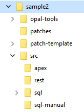
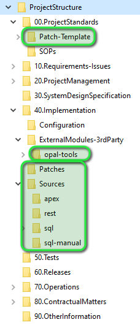
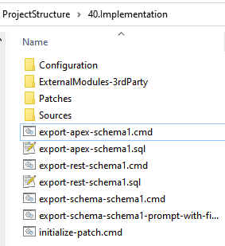
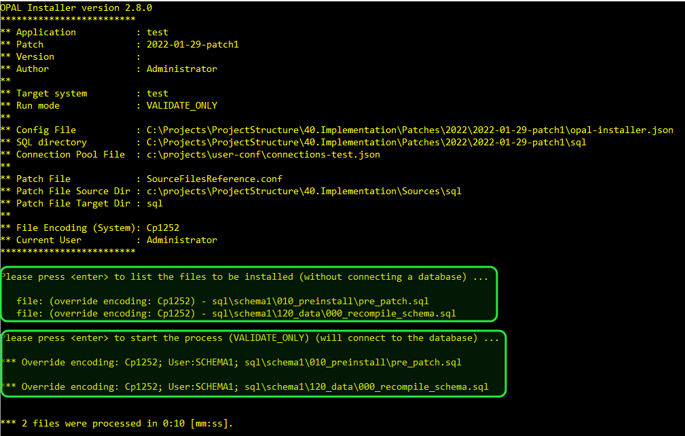
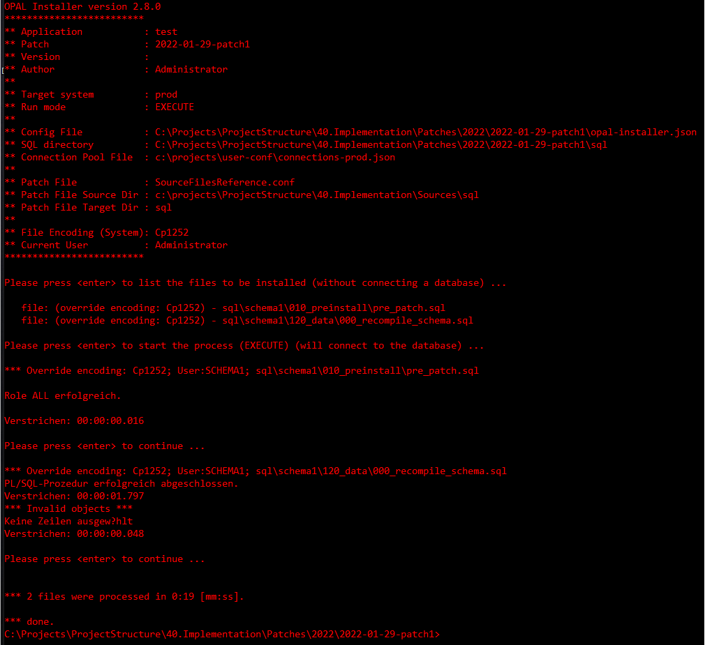

* [About](#about)
  * [General Concepts](#general-concepts)
  * [Shell Scripting](#shell-scripting)
  * [File Encodings](#file-encodings)
  * [Java Regular Expressions](#java-regular-expressions)
* [Installation](#installation)
* [Configuration Steps After the Installation](#configuration-steps-after-the-installation)
* [Upgrading](#upgrading)
* [Exporter Use Cases](#exporter-use-cases)
  * [Exporting Database Objects](#exporting-database-objects)
  * [Exporting APEX Applications](#exporting-apex-applications)
  * [Exporting REST Applications](#exporting-rest-applications)
* [Installer Use Cases](#installer-use-cases)
  * [Initialize a New Patch](#initialize-a-new-patch)
  * [Copy Source Files into the Patch Directory](#copy-source-files-into-the-patch-directory)
  * [Validate Patch](#validate-patch)
  * [Install Patch](#install-patch)
  * [Create Distribution Zip File for Manual Installation](#create-distribution-zip-file-for-manual-installation)
* [Troubleshooting](#troubleshooting)
  * [Turn on Debugging](#turn-on-debugging)
  * [Kown Issues](#known-issues)
* [Reference](#reference)
  * [opal-install](#opal-install)
    * [Command Line](#command-line)
    * [Database Log Tables](#database-log-tables)
  * [opal-export](#opal-export)
    * [Command Line](#command-line-1)
    * [Shared Command Line Switches](#shared-command-line-switches)
  * [opal-export-scripts-for-manual-install](#opal-export-scripts-for-manual-install)
    * [Command Line](#command-line-2)
  * [Configuration Files](#configuration-files)
    * [Connection Pool Files](#connection-pool-files)
    * [opal-installer.json](#opal-installerjson)
    * [ReleaseNotes.txt](#releasenotestxt)
    * [SourceFilesCopy.conf](#sourcefilescopyconf)
    * [SourceFilesReference.conf](#sourcefilesreferenceconf)

# About

## General Concepts

### Directories / File System Structure

Generally, we have different areas / file folders in this approach. 

#### opal-tools

This directory contains the actual Java software, configuration files and project specific shell scripts which are generated during the installation process. 

The follwing directories will be created: 
* ``bin``: Generated shell and sql scripts to export database objects, APEX applications and REST modules. 
* ``conf``: 
  - Property files for logging purposes. 
  - ``opal-export.conf``: shared configuration settings for exporting objects
  - ``opal-installer.json``: shared configuration settings for the installer
* ``export-scripts``: 
  - ``opal-export-pre-script.sql``: is run with each export and configures ``DBMS_METADATA`` to produce the ddl output we desire. 
* ``export-templates``: allows special handling of exporting database objects, e.g. when we want to work around a bug in ``DBMS_METADATA`` or have specific needs for the generated ddl.
* ``lib``: contains all required Java libraries. 

#### patch-template

A new patch directory is created as a copy of this directory. Thus, if you want to make changes to all future patches, modify the contents here. You can also add documents and subdirectories.

#### src

In this directory all project source files will be stored, initially we have created the following structure: 
* ``apex``: all APEX applications go here regardless of the database schema
* ``rest``: all REST modules from Oracle REST Data Services (ORDS) go here
* ``sql``: all SQL sources exported using ``DBMS_METADATA`` go here
  - ``schema1``: all database objects exported for ``schema1``, they are exported by object_type
    - ``tables``
    - ``packages``
    - ``views``
    - ``...``
* ``sql-manual``: not all scripts can be derived 1:1 from an existing database object, e.g. when you manually build a script to create synonyms and grants for all objects in the current schema. This is a hand-crafted script and cannot be generated automatically. 

#### patches

All changes to your applications will be stored under ``patches``. They are by default organized by year and then current date + name of the patch (which is a copy of ``patch-template``), e.g.: 
- ``patches``
  - ``2022``
    - ``2022-01-27-patch1``

### Separation of Scripts

**Local user environment vs. shared installation through version control repository**: All of the above directories should be stored in a directory connected to your version control repository for your project, e.g. Git or Subversion. 

In addition to that we also need a local directory (**for each developer**) which will be ***not*** part of the version control repository. In this directory we will store the user configuration (e.g. ``conf-user``), the connection pool definition and a setup script for the local environment. 

* ``connections-dev.json``: this is the connection pool file for the environment ``dev`` for development
* ``setProjectEnvironment.sh``: each script is calling ``setProjectEnvironment.sh`` to set up the environment. 

## Shell Scripting

The setup will pre-generate a number of shell scripts. Those shell scripts will leverage the command line options of the different tools, e.g.: 
```
cd "%OPAL_TOOLS_SRC_SQL_DIR%"

@call opal-export.cmd --config-file "%OPAL_TOOLS_HOME_DIR%\conf\opal-export.conf" ^
                      --output-dir "%OPAL_TOOLS_SRC_SQL_DIR%" ^
                      --pre-scripts "%OPAL_TOOLS_HOME_DIR%\export-scripts\opal-export-pre-script.sql" ^
                      --connection-pool-name #SCHEMA# ^
                      --connection-pool-file "%OPAL_TOOLS_USER_CONFIG_DIR%\connections-#ENV#.json"
```

We are using multi-line command lines. If you make changes, please be aware to use the proper line ending in shell scripts like ``\`` for bash and ``^`` for Windows as the last character on the line. **Please make sure, there is no ``space`` after the ``^`` character at the end. Else it will cause errors!**

We also leverage all environment variables that are set up in the script ``user-conf/setProjectEnvironment.[sh|cmd]``, so that you don't have to hardcode any paths. 

## File Encodings

It is important to be aware of different file encodings. Different operating systems will encode files differently by default, e.g. a German Windows system will use ``Cp1252`` by default whereas a Linux or MacOS system will typically use ``UTF-8``. 

When using special characters like German umlauts that can quickly become a problem. So, please make sure to define carefully what your default setting will be, you can set it during install. This will affect the parameter ``-Dfile.encoding=`` we will pass on the command line to the Java tools (you can see that in the ``setProjectEnvironment.[sh|cmd]`` script). 

Also, please make sure your SQL editors like Visual Studio Code, Notepad++, SQL Developer, Toad, etc. are configured by default to produce files in the encoding you want to use. 

If you have a team of developers using different operating systems, ``UTF-8`` seems to be the best choice. 

Your choice during setup will also generate the right mapping into the file [opal-installer.json](#opal-installerjson) in your patch-template directory (sample for Linux/MacOS): 
```
  "encodingMappings": [
    {
      "encoding": "UTF-8",
      "fileFilter": "/sql/*apex*/*f*sql",
      "description": "encoding for APEX files is always UTF8"
    },
    {
      "encoding": "Cp1252",
      "fileFilter": "/sql/*",
      "description": "all other files will get this explicit mapping"
    }
  ],
```
APEX files are always exported as UTF-8 by SQLcl or the APEXExport class utility, no matter what you define in ``-Dfile.encoding``. 

## Java Regular Expressions

We are using Java Regular expressions in a number of places in the ``opal-installer.json`` file. The syntax can be found here: https://docs.oracle.com/javase/7/docs/api/java/util/regex/Pattern.html .

Special characters need to be escaped. And they need to be escaped again when reading the regular expression from a file in a string. 

Thus, when matching a file system path on Windows, e.g. ``\sql\`` the proper regular expression is ``\\\\sql\\\\`` because the ``\`` needs to be escaped **twice**:
* ``\sql\`` => ``\\sql\\`` for escaping the (regular expression) special character ``\``
* ``\\sql\\`` => ``\\\\sql\\\\`` for escaping the (Java) special character ``\`` in a Java String. 

**Starting with version 2.8.0** a simpler version of file filters has been implemented. In the configuration file, you can use ``fileFilter`` instead of ``fileRegex`` for connection mappings or encoding mappings: 
Only ``/`` and ``*`` as special characters are available, but this is enough for most use cases. This syntax will be identical for ALL operating systems.
  * ``/``: matches a subdirectory (``/`` on Linux and ``\`` on Windows)
  * ``*``: machtes any number of characters

# Installation

## Installation Considerations

This tool is very flexible and can be adapted to your needs. 

There are a few things to think about first before getting started. 
* **Will all developers be using the same operating system** (either all on Linux, MacOS or Windows) or will there be a mix of Linux/MacOS and Windows? 
  - When installing for a single operating system, simply run the command ``setup.[cmd|sh]`` and choose the setup mode ``install``. 
  - When installing for multiple operating systems, follow these steps:
    1. On the first operating system (e.g. MacOS), run the command ``setup.sh`` and choose the setup mode ``install``.
    2. Check the project directory into your version control repository. 
    3. Log on to the second operating system (e.g. Windows) and check out the project directory from your version control repository. 
    4. Run the command ``setup.cmd`` and choose the setup mode ``scripts``. This will generate **only** the required scripts in order to support this operating system for an already existing installation. It will not do a complete install of all required files. 
* **Can all developers use the identical path to their local configuration file?**  
  - It would be easiest, when all developers used the same local configuration directory, e.g. ``c:\conf-user`` on Windows. Then you can use an absolute path to this local configuration script. 
  - If we cannot use the same absolute path for all developers then the script name will have to be resolved through the ``PATH`` system configuration. But this is not always possible when privileges to the machine are restricted. 

## Running the installation

Once downloaded and unzipped you run the command ``setup.sh`` or ``setup.cmd``. This will copy and customize the appropriate files. 

During the setup process you will be prompted to enter specific file locations (directories) so that you can fully customize the environment. For starters it is recommended to use the defaults and get familiar with it. 

The prompts are (defaults are shown in brackets [] and accepted by just pressing ``<enter>``): 

* ``Project root directory, typically the target of a GIT or SVN export``: 
    - In most cases, you will use a central directory and all files for this project checked out from the version control repository. 
* ``Local configuration directory (connection pools, user dependent config)``: 
    - Here the installer will find the connection pools for this user environment. 
    - Typically, this is NOT part of the SVN or GIT repository because it contains passwords and also might be different for each user. 
* ``Local script to initialize the user environment for this project``: 
    - This script will include all locations and store them in variables. Only those variables are used in the generated scripts. 
    - Thus, all you need to change is the contents of this file. 
    - When you are developing with multiple developers you can : 
        - choose to store this file ON EACH developer machine in the same location, then you enter a fully qualified path, e.g.: ``c:\local-config\setProjectEnvironment.cmd``
        - choose to change the %PATH% variable and add this script to the path, then you enter the script name without any path, e.g. ``setProjectEnvironment.cmd``
* ``List of database schemas (blank-separated, e.g. schema1 schema2) [schema1 schema2]``:
    - how many different schemas do we want to install into? 
    - This comma separated list will be used to generate the connection pool files. 
* ``List of environments (blank-separated, e.g. dev test prod) [dev test prod]``:
    - how many different environments do we want to install into? 
    - This comma separated list will be used to generate the connection pool files. 
* ``List of shell colors for the environments (blank-separated, e.g. green yellow red) [green yellow red]``:
    - The generated batch scripts for each environment can take on different foreground colors. 
    - This makes installing into a test environment (yellow) or production environment (red) more obvious.
* ``Which is your developement environment? This is used for the export:  [dev]``:
    - The designated development enviroment will be used in the export scripts as the source database connection.
* ``file encoding (e.g. UTF-8 or Cp1252, default is current system encoding):``:
    - The file encoding can be become very critical when using special characters like the German umlauts or others. 
    - This setting will be used to generate ``-Dfile.encoding=`` settings for the Java command lines. 
    - The APEX export tools will always generate UTF-8 encoded files. 
    - During installation the default from the operation system is picked up, this is for example UTF-8 on MacOS and Cp1252 on Windows. 

All environment variables are set up in the "**Local script to initialize the user environment**", e.g.: ``c:\opal-installer-local\setProjectEnvironment-project1.cmd``. 

# Configuration Steps After the Installation

Typically, it makes sense to first install the software using the defaults into a temporary location and later move them into the project target locations. 

1. So, in our example, we will end up with the following initial file system structure: 



2. We can just copy or move those directories into our target structure like this: 



3. Now we only have to update those new target locations in our local configuration script, e.g. ``setProjectEnvironment.cmd``: 

```
@REM --------------------------------------------------------------------------
@REM User specific configuration
@REM --------------------------------------------------------------------------
set PROJECT_ROOT=C:\Projects\ProjectStructure
set OPAL_TOOLS_USER_IDENTITY=Administrator
set OPAL_TOOLS_USER_CONFIG_DIR=c:\projects\user-conf

set OPAL_TOOLS_HOME_DIR=%PROJECT_ROOT%\40.Implementation\ExternalModules-3rdParty\opal-tools
set OPAL_TOOLS_SRC_DIR=%PROJECT_ROOT%\40.Implementation\Sources
set OPAL_TOOLS_SRC_APEX_DIR=%OPAL_TOOLS_SRC_DIR%\apex
set OPAL_TOOLS_SRC_REST_DIR=%OPAL_TOOLS_SRC_DIR%\rest
set OPAL_TOOLS_SRC_SQL_DIR=%OPAL_TOOLS_SRC_DIR%\sql
set OPAL_TOOLS_PATCH_TEMPLATE_DIR=%PROJECT_ROOT%\00.ProjectStandards\Patch-Template
set OPAL_TOOLS_PATCH_DIR=%PROJECT_ROOT%\40.Implementation\Patches
```

4. We also recommend copying the following scripts into the ``40.Implementation`` directory, because here we are navigating anyway when working on the sources and/or patches: 



# Upgrading

When you want to upgrade an installtion to a newer version of the opal-tools, please follow the steps from the release notes. 
But in general, replacing the ``opal-tools/lib`` directory is enough to upgrade the software by itself. 

If you want to make use of newer features, you will have to follow the manual steps in the release notes to update your environment. This cannot be upgraded automatically, because will have made changes to the existing files and/or locations of files. And this is desired. 

# Exporter Use Cases

Here we will describe the different scripts and how to customize them. During installation, you should provide a number of database schemas with which you will work with. In our sample, we will only work in the schema ``schema1``. 

### Three-step execution

In general, all exports are done in a three-step process: 

1. pre-script execution through the embedded SQLcl engine
2. exporting the selected database objects using ``DBMS_METADATA``
3. post-script execution through the embedded SQLcl engine

By default, all scripts use the pre-script ``"%OPAL_TOOLS_HOME_DIR%\export-scripts\opal-export-pre-script.sql"`` via the command line option ``--pre-scripts`` where you can specify one or multiple sql scripts to be executed before the dbms_metadata export starts. 

The default file sets configuration options for ``DBMS_METADATA``: 
```
set sqlformat ansiconsole

prompt *** set dbms_metadata transform parameter

BEGIN
   DBMS_METADATA.SET_TRANSFORM_PARAM (DBMS_METADATA.SESSION_TRANSFORM, 'SQLTERMINATOR', TRUE);
   DBMS_METADATA.SET_TRANSFORM_PARAM (DBMS_METADATA.SESSION_TRANSFORM, 'SEGMENT_ATTRIBUTES', FALSE); --undocumented remove segement creation
   DBMS_METADATA.SET_TRANSFORM_PARAM (DBMS_METADATA.SESSION_TRANSFORM, 'EMIT_SCHEMA', FALSE); --undocumented remove schema
   DBMS_METADATA.SET_TRANSFORM_PARAM (DBMS_METADATA.SESSION_TRANSFORM, 'SEGMENT_CREATION', FALSE);
   DBMS_METADATA.SET_TRANSFORM_PARAM (DBMS_METADATA.SESSION_TRANSFORM, 'CONSTRAINTS_AS_ALTER', TRUE);
   DBMS_METADATA.SET_TRANSFORM_PARAM (DBMS_METADATA.SESSION_TRANSFORM, 'PRETTY', TRUE);
   
   -- don't export ref_constraints with table, should be separate in 
   -- directory ref_constraints
   DBMS_METADATA.SET_TRANSFORM_PARAM (DBMS_METADATA.SESSION_TRANSFORM, 'REF_CONSTRAINTS', FALSE);
END;
/
```

If you need different settings, you can simply modify the file. 

The post-script mechanism is used for exporting APEX and REST applications.

### Command line switches

Let's examine the script ``export-schema-schema1.cmd``: 
```
@call opal-export.cmd --config-file "%OPAL_TOOLS_HOME_DIR%\conf\opal-export.conf" ^
                      --output-dir "%OPAL_TOOLS_SRC_SQL_DIR%" ^
                      --pre-scripts "%OPAL_TOOLS_HOME_DIR%\export-scripts\opal-export-pre-script.sql" ^
                      --connection-pool-name schema1 ^
                      --silent ^
                      --connection-pool-file "%OPAL_TOOLS_USER_CONFIG_DIR%\connections-dev.json"
```
* the command line switch ``--config-file`` will pick up additional, shared command line options which can be shared across all export scripts, e.g.:

```
...
--excludes SYS_YOID% SYS_PLSQL% AQ$%
--exclude-types LOB "TABLE_PARTITION" "INDEX PARTITION" "JAVA CLASS" JAVA "JAVA RESOURCE" INDEX
--filename-templates default:#schema#/#object_type_plural#/#object_name#.sql package:#schema#/packages/#object_name#.pks "package body:#schema#/packages/#object_name#.pkb"
...
```
  * this will exclude automatically generated sys objects as well objects related to the Advanced Queuing option.
  * it will also exclude certain object types we don't want to export as sources/individual objects because they are either generated automatically or exported as dependent objects (e.g. INDEXES as dependent objects of TABLES)
  * the ``--filename-templates`` will define the naming convention for the exported database objects

* ``--output-dir "%OPAL_TOOLS_SRC_SQL_DIR%"``: the sources will be spooled into the sql directory under sources
* ``--pre-scripts "%OPAL_TOOLS_HOME_DIR%\export-scripts\opal-export-pre-script.sql"``: to set up the configuration for ``DBMS_METADATA``, the default pre-script is run
* ``--connection-pool-file "%OPAL_TOOLS_USER_CONFIG_DIR%\connections-dev.json"``: we will connect to the development database using the ``connections-dev.json`` connection pool file
* ``--connection-pool-name schema1``: from the connection pool file, we choose the database user named ``schema1``
* ``--silent``: in "silent-mode" we are not prompted, the script finishes without user interaction

## Exporting Database Objects

Generally speaking, the export mechanism uses the standard Oracle package ``DBMS_METADATA`` to generate the DDL for the requested database objects you want to export into the filesystem. 

### export all

When you execute the script ``export-schema-schema1.cmd``, you will export all database objects into the target directory ``%OPAL_TOOLS_SRC_SQL_DIR%``: 

```
  OPAL_INSTALLER_DETAILS_FK1[REF_CONSTRAINT]      => schema1\ref_constraints\opal_installer_details_fk1.sql
  SHOW_TEST[FUNCTION]                             => schema1\functions\show_test.sql
  XLIB_HTTP[PACKAGE]                              => schema1\packages\xlib_http.pks
  XLIB_HTTP[PACKAGE BODY]                         => schema1\packages\xlib_http.pkb
  XLIB_JASPERREPORTS[PACKAGE]                     => schema1\packages\xlib_jasperreports.pks
  XLIB_JASPERREPORTS[PACKAGE BODY]                => schema1\packages\xlib_jasperreports.pkb
  OPAL_INSTALLER_DETAILS[TABLE]                   => schema1\tables\opal_installer_details.sql
  OPAL_INSTALLER_PATCHES[TABLE]                   => schema1\tables\opal_installer_patches.sql
  DUMMY[TABLE]                                    => schema1\tables\dummy.sql
  XLIB_JASPERREPORTS_IMG[PACKAGE]                 => schema1\packages\xlib_jasperreports_img.pks
  XLIB_JASPERREPORTS_IMG[PACKAGE BODY]            => schema1\packages\xlib_jasperreports_img.pkb
  XLIB_LOG[PACKAGE]                               => schema1\packages\xlib_log.pks
  XLIB_LOG[PACKAGE BODY]                          => schema1\packages\xlib_log.pkb
  XLIB_JASPERREPORTS_CONF[TABLE]                  => schema1\tables\xlib_jasperreports_conf.sql
  XLOG[PROCEDURE]                                 => schema1\procedures\xlog.sql
  XLIB_LOGS_MV[TABLE]                             => schema1\tables\xlib_logs_mv.sql
  XLIB_JASPERREPORTS_DEMOS[TABLE]                 => schema1\tables\xlib_jasperreports_demos.sql
  XLIB_LOGS[TABLE]                                => schema1\tables\xlib_logs.sql
```

### export with filter

Sometimes you don't want to export all schema objects but only a single one or a subset of the objects. 

When you execute the script ``export-schema-schema1-prompt-with-filter.cmd``, you can provide a filter for the objects you want to export into the target directory ``%OPAL_TOOLS_SRC_SQL_DIR%``: 

```
"Object wildcards can be * or %. The %-sign needs to be escaped for the shell: % => %%"
Filter for DDL object names including wildcards, e.g. "xlib*" or "xlib%%":
```

As filters, you can provide one or multiple filters (separated by a space character) which will be matched against the ``OBJECT_NAME`` in the ``USER_OBJECTS`` database view. 

For example, we can enter ``xlib_log \*jasper\*``. This will translate into the following where clause when choosing database objects: ```where (object_name='XLIB_LOG' or object_name like '%JASPER%')```: 

```
  XLIB_JASPERREPORTS[PACKAGE]                     => schema1\packages\xlib_jasperreports.pks
  XLIB_JASPERREPORTS[PACKAGE BODY]                => schema1\packages\xlib_jasperreports.pkb
  XLIB_JASPERREPORTS_IMG[PACKAGE]                 => schema1\packages\xlib_jasperreports_img.pks
  XLIB_LOG[PACKAGE]                               => schema1\packages\xlib_log.pks
  XLIB_JASPERREPORTS_CONF[TABLE]                  => schema1\tables\xlib_jasperreports_conf.sql
  XLIB_JASPERREPORTS_DEMOS[TABLE]                 => schema1\tables\xlib_jasperreports_demos.sql
  XLIB_JASPERREPORTS_IMG[PACKAGE BODY]            => schema1\packages\xlib_jasperreports_img.pkb
  XLIB_LOG[PACKAGE BODY]                          => schema1\packages\xlib_log.pkb
```

Please be aware of the special characters ``*`` (will expand all files in the current directory on Linux) and ``%`` (indicates an environment variable). Should you experience error when using those special characters, you can put the full filter in quotes, e.g. ``"xlib_log \*jasper\*"``. 

### changing the location of the generated files

When you want to change the naming of the exported database objects, you will have to modify the command line switch ``--filename-templates`` in the shared config file: ``%OPAL_TOOLS_HOME_DIR%\conf\opal-export.conf``.

For details, see [opal-export](#opal-export). 

### including / excluding object types

For details, see [opal-export](#opal-export). 

### special export handling based on the object type

In very rare cases you might not be happy with the generated DDL from ``DBMS_METADATA``. In that case, you can override the default behaviour with your own code. 

You will have to put your file into the directory ``opal-tools/export-templates`` and name it ``<object_type>.sql``. 
We use this mechanism to fix the generation of synonyms that point to an object in a different schema. 

Thus, we use the script ``opal-tools/export-templates/synonym.sql``:

```
declare
  function get_ddl return clob is
    l_schema varchar2(100) := ?;
    l_object_type varchar2(100) := ?;
    l_object_name varchar2(100) := ?;
    
    l_clob clob;
  begin
    DBMS_METADATA.SET_TRANSFORM_PARAM (DBMS_METADATA.SESSION_TRANSFORM, 'EMIT_SCHEMA', TRUE); --undocumented remove schema

    select dbms_metadata.get_ddl(object_type => l_object_type,
                                 name => l_object_name,
                                 schema => l_schema) into l_clob from dual;

    DBMS_METADATA.SET_TRANSFORM_PARAM (DBMS_METADATA.SESSION_TRANSFORM, 'EMIT_SCHEMA', FALSE); --undocumented remove schema

    l_clob := replace(l_clob, '"'||l_schema||'".', '');

    return l_clob;
  end;
BEGIN
    :retval := get_ddl();
END;
```

This mechanism will execute your code dynamically, bind the variables ``schema``, ``object_type`` and ``object_name`` and expects a string with your custom ddl statement in return. 

## Exporting APEX Applications

When you execute the script ``export-apex-schema1.cmd``, you will start the corresponding ``export-apex-schema1.sql`` script. 
In there, you can use the SQLcl syntax for ``apex export`` in order to export your specific APEX applications, e.g.: 

```
prompt *** exporting apex applications from the workspace
-- determine workspace-id with select * from apex_workspaces
apex export -workspaceid 1635506190835543 

prompt *** exporting apex application 201
apex export -applicationid 201 -expOriginalIds
```

## Exporting REST Applications

When you execute the script ``export-rest-schema1.cmd``, you will start the corresponding ``export-rest-schema1.sql`` script. 
In there, you can use the SQLcl syntax for ``rest export`` in order to export your specific REST applications, e.g.: 

```
prompt *** spool rest modules
spool my_rest_modules_export.sql

rest export
prompt /

spool off
```
# Installer Use Cases

The installer uses SQLcl under the hood to actually run the SQL scripts. The core engine is very simple. It will execute SQL files which it finds by iterating through the filesystem and listing all files that exist. 

It uses regular expressions in order to figure out a mapping between a file system path and the matching connection pool. 
It can be configured in multiple ways so that there is no requirement for a specific layout of the filesystem. 

## Initialize a New Patch

Whenever we intend to make changes to the software (either for a ticket or a new release), the first step is to create a new patch directory by calling the script ``initialize-patch.cmd``. 

In there, you will be prompted for a patch name and then the ``patch-template`` directory is copied to the new location: ``patches/yyyy/yyyy-mm-dd-patch name``, e.g. ``patches/2022/2022-01-29-patch1``. If you need a different structure, you can simply modify the shell script. 

Then, you can directly store all scripts that are just relevant for this particular change in the proper location. E.g. we want to add a new column to the table ``XLIB_LOGS`` in the schema ``SCHEMA1``, we would manually create the file: ``sql/schema1/040_tables/xlib_logs.sql``. 

This approach of creating the patch first is different from how most people develop code. They code for quite a while and create a patch as an afterthought. In the meantime, they have to keep track of all the changes, especially, when altering database objects. 

## Copy Source Files into the Patch Directory

In order to include database source files from our source tree, we can register them in the file ``SourceFilesCopy.conf`` and then copy them into the target patch directory using ``1.copy-source-files.cmd``. 

For more details on the syntax see: [SourceFilesCopy.conf](#sourcefilescopyconf).

Sometimes you might prefer not to copy the files but only to reference the source files like packages, views, types, triggers, etc. from your source tree.

In that case you have to register all files that you want in the patch in the file ``SourceFilesReference.conf``. They will not be copied to the target patch directory ... but used in the sort order as if they were copied. Their virtual target path will be used to determine the order of the execution of the file. But the actual file will reside in the source tree.

For more details see: [SourceFilesReference.conf](#sourcefilesreferenceconf).

## Validate Patch

With running ``2.validate-patch-test.cmd`` you can validate the patch against the test environment and ``2.validate-patch-prod.cmd`` will validate the patch against the prod environment. 

What does it do? 



* In the first pass, it will simply list the files so that you can check they appear in the correct order
* In the second pass, the installer will actually connect to the target database, check the connection and compute the database user (based on the file system mappings) and the target encoding for the file. Both are configured in the configuration file ``opal-installer.json``.

As you can see, it will also use the color coding for the different environments to give you a visual indication on which environment you are actually working. 

## Install Patch

With running ``3.install-patch-test.cmd`` you can install the patch in the test environment and ``3.install-patch-prod.cmd`` will install the patch in the prod environment. 

What does it do? 



* In the first pass, it will simply list the files so that you can check they appear in the correct order
* In the second pass, the installer will actually connect to the target database and execute the files
* A log file will be written into the ``logs`` subdirectory of the patch

As you can see, it will also use the color coding for the different environments to give you a visual indication on which environment you are actually working. 

You will be prompted for each script that is executed. If you want to change that, you can use the command line option ``--silent-execution`` as described here: [opal-install](#opal-install).

## Create Distribution Zip File for Manual Installation

Sometimes we are restricted in our ability to install the scripts against the test or production databases. Only the DBAs are allowed to install the software. Also, they often don't like the fact that they have to install an additional tool to run the scripts. They want to review the sql files and run them using sqlplus or sqlcl. 

To support this workflow you can call ``4.export-scripts-for-manual-install.cmd``, this will generate three zip files: 
* ``<patch name>.zip``, e.g. ``2022-01-29-patch1.zip``: contains all scripts to be run. All scripts will be executed without user interaction
* ``<patch name>-with-prompts.zip``, e.g. ``2022-01-29-patch1-with-prompts.zip``: all scripts will be executed one by one with user interaction. You have to confirm after each script. 
* ``<patch name>-utf8.zip``, e.g. ``2022-01-29-patch1-utf8.zip``: executes all scripts without user interaction. All files are converted to UTF-8 before they are added to the zip file. 

You can add further files to the zip file by adding them to the command line option:
```
--zip-include-files "%OPAL_TOOLS_HOME_DIR%\export-scripts\prompt.sql" ReleaseNotes.txt
```
This is very useful when you want to add documentation or your own instructions for the DBAs to the zip file directly. 

For details see: [opal-export-scripts-for-manual-install](#opal-export-scripts-for-manual-install).

# Troubleshooting

## Turn on Debugging

Debugging is easily turned on in your local configuration file ``setupProjectEnvironment.[cmd|sh]``: 

```
@echo ON

...

@REM DEBUG: for debugging, use these log file settings
set OPAL_TOOLS_JAVA_ARGS=-Dlog4j.configurationFile="%OPAL_TOOLS_HOME_DIR%\conf\log4j2-debug.xml" -Djava.util.logging.config.file="%OPAL_TOOLS_HOME_DIR%\conf\logging-debug.properties" -Dfile.encoding=Cp1252
```


## Known Issues

### Warning message: ``Unable to get Charset 'cp65001' for property 'sun.stdout.encoding', using default windows-1250 and continuing``.

This message only indicates that the character set for the console output cannot be determined from the current shell environment. See more details and workarounds here: https://github.com/daust/opal-installer/issues/8. 

### OPAL Installer: Java exception ``java.lang.AssertionError: sqlplus comment``

You might see the following error message when executing a sql file (e.g. an APEX export file): 
```
java.lang.AssertionError: sqlplus comment
	at oracle.dbtools.parser.NekotRexel.tokenize(NekotRexel.java:128)
	at oracle.dbtools.parser.NekotRexel.parse(NekotRexel.java:314)
	at oracle.dbtools.parser.LexerToken.parse(LexerToken.java:527)
	at oracle.dbtools.parser.LexerToken.parse(LexerToken.java:482)
	at oracle.dbtools.parser.LexerToken.parse(LexerToken.java:475)
	at oracle.dbtools.parser.LexerToken.parse(LexerToken.java:459)
	at oracle.dbtools.parser.LexerToken.parse(LexerToken.java:425)
	at oracle.dbtools.parser.Lexer.parse(Lexer.java:11)
	at oracle.dbtools.raptor.newscriptrunner.ScriptRunner.runPLSQL(ScriptRunner.java:330)
	at oracle.dbtools.raptor.newscriptrunner.ScriptRunner.run(ScriptRunner.java:245)
	at oracle.dbtools.raptor.newscriptrunner.ScriptExecutor.run(ScriptExecutor.java:344)
	at oracle.dbtools.raptor.newscriptrunner.ScriptExecutor.run(ScriptExecutor.java:227)
	at de.opal.installer.Installer.executeFile(Installer.java:483)
	at de.opal.installer.Installer.processTree(Installer.java:431)
	at de.opal.installer.Installer.run(Installer.java:283)
	at de.opal.installer.InstallerMain.main(InstallerMain.java:72)
```
This seems to be an issue with the tokenizer in SQLcl. The statement itself is executed properly nevertheless. Thus you can ignore it. 

Here are more details on it: https://twitter.com/daust_de/status/1331865412984844289 . 


# Reference
## opal-install

### Command Line

The installer comes with a specific setup that will work in many cases. If you have other requirements, here is a description of the command line switches that you can use: 

```
 -h (--help)                                      : show this help page (Vorgabe: false)
 --connection-pool-file <file>                    : connection pool file
                                                    e.g.: connections-dev.json
 --config-file <file>                             : configuration file
                                                    e.g.: opal-installer.json
 --validate-only                                  : don't execute patch, just validate the files and connection pools (Vorgabe:
                                                    false)
 --mandatory-attributes <attr1> [<attr2>] ... [n] : list of attributes that must not be null,
                                                    e.g. patch author version
 --no-logging                                     : disable writing a logfile (Vorgabe: false)
 --source-list-file <filename>                    : source file name, e.g. SourceFilesReference.conf
 --source-dir <path>                              : path to the source directory, e.g. ../src/sql
 --silent                                         : disable all prompts, non-interactive mode (Vorgabe: false)
 --silent-execution                               : prompt after header information, execute all scripts without prompt.
```

### Database Log Tables

Logfiles are always generated automatically but the automatic logging into database tables is turned off initially. 

You can turn it on by configuring the parameter ``registryTargets`` in the configuration file [opal-installer.conf](#opal-installerjson). 

The simplest way is to define a connection pool to install the tables for the log registry. You pick a definition from your ``connections-<environment>.json`` file: 

```
  "registryTargets": [
      {
          "connectionPoolName": "schema1",
          "tablePrefix": "OPAL"
      }
  ],
```

This table will then be installed into **each** target environment that you install into. 

You can define multiple registryTargets, e.g.: 
```
  "registryTargets": [
      {
          "connectionPoolName": "schema1",
          "tablePrefix": "OPAL"
      },
      {
          "connectionPoolName": "global-registry",
          "tablePrefix": "OPAL"
      }
  ],
```

We are using it in this way so that we record each patch in the target schema and in our development environment **as well**. 

Therefore, we need an entry like this **in each** connection pool definition file pointing back to our development environment:
```
    {
      "name": "global-registry",
      "user": "schema1",
      "password": "pwd",
      "connectString": "127.0.0.1:1521:xe"
    }
```

You can query the tables:
```
SELECT *
  FROM opal_installer_patches
 ORDER BY pat_id DESC;
    
SELECT *
  FROM opal_installer_details
 ORDER BY det_id DESC;  
```

The tables are defined as follows: 
```
OPAL_INSTALLER_PATCHES

Name                   Null?    Typ                 
---------------------- -------- ------------------- 
PAT_ID                 NOT NULL NUMBER              
PAT_APPLICATION                 VARCHAR2(100 CHAR)  
PAT_NAME                        VARCHAR2(100 CHAR)  
PAT_REFERENCE_ID                VARCHAR2(100 CHAR)  
PAT_VERSION                     VARCHAR2(100 CHAR)  
PAT_AUTHOR                      VARCHAR2(100 CHAR)  
PAT_TARGET_SYSTEM               VARCHAR2(50 CHAR)   
PAT_EXTRA                       VARCHAR2(4000 CHAR)
PAT_STARTED_ON                  DATE                
PAT_ENDED_ON                    DATE                
PAT_DESCRIPTION                 VARCHAR2(4000 CHAR) 
PAT_CONFIG_FILENAME             VARCHAR2(4000 CHAR) 
PAT_CONN_POOL_FILENAME          VARCHAR2(4000 CHAR) 
```

```
OPAL_INSTALLER_DETAILS

Name             Null?    Typ                 
---------------- -------- ------------------- 
DET_ID           NOT NULL NUMBER              
DET_FILENAME              VARCHAR2(4000 CHAR) 
DET_INSTALLED_ON          DATE                
DET_PAT_ID                NUMBER              
```


## opal-export

### Command Line

The exporter comes with a specific setup that will work in many cases. If you have other requirements, here is a description of the command line switches that you can use: 

```
 -h (--help)                                                : show this help page (Vorgabe: false)
 -v (--version)                                             : show version information (Vorgabe: false)
 --url <jdbc url>                                           : database connection jdbc url,
                                                              e.g.: scott/tiger@localhost:1521:ORCL
 --connection-pool-file <file>                              : connection pool file
                                                              e.g.: connections-dev.json
 --connection-pool-name <connection pool name>              : connection pool name
                                                              e.g.: scott
 --output-dir <directory>                                   : output directory, e.g. '.' or '/u01/project/src/sql'
 --includes <filter1> [<filter2>] ... [n]                   : include filter, e.g.: %XLIB% or *XLIB*
 --include-types <type1> [<type2>] ... [n]                  : include types, e.g.: TABLE PACKAGE
 --excludes <type1> [<type2>] ... [n]                       : exclude filter, e.g.: %AQ$% %SYS_% or
 --exclude-types <type1> [<type2>] ... [n]                  : exclude types, e.g.: JOB
 --include-schemas <schema1> [<schema2>] ... [n]            : schemas to be included, only relevant when connecting as DBA
 --escape-char <escape character>                           : add escape() clause to like queries for selecting objects, e.g. \
                                                              or ~
 --dependent-objects <type>:<deptype1>,<deptype2> ... [n]   : dependent objects, e.g. TABLE:COMMENT,INDEX
 --skip-errors                                              : ORA- errors will not cause the program to abort (Vorgabe: false)
 --skip-export                                              : skip the export, this way only the pre- and post-scripts are run
                                                              (Vorgabe: false)
 --pre-scripts <script> [<script2>] ...                     : script (sqlplus/sqlcl) that is running to initialize the session,
                                                              similar to the login.sql file for sqlplus, e.g. ./login.sql or
                                                              ./init.sql
 --post-scripts <script> [<script2>] ...                    : script (sqlplus/sqlcl) that is running in the end to export custom
                                                              objects, e.g. ./apex.sql
 --silent                                                   : turns off prompts (Vorgabe: false)
 --filename-templates <definition 1> [<definition 2>] [...] : templates for constructing the filename per object type
                                                              e.g.: default:#schema#/#object_type#/#object_name#.sql
                                                              e.g.: package:#schema#/#object_type#/#object_name#.pks
                                                              e.g.: "package body:#schema#/packages/#object_name#.pkb"

                                                              #schema#             - schema name in lower case
                                                              #object_type#        - lower case type name: 'table'
                                                              #object_type_plural# - lower case type name in plural: 'tables'
                                                              #object_name#        - lower case object name
                                                              #SCHEMA#             - upper case schema name
                                                              #OBJECT_TYPE#        - upper case object type name: 'TABLE' or
                                                              'INDEX'
                                                              #OBJECT_TYPE_PLURAL# - upper case object type name in plural:
                                                              'TABLES'
                                                              #OBJECT_NAME#        - upper case object name
 --filename-replace-blanks                                  : replaces blanks in the filename with an _, e.g. PACKAGE
                                                              BODY=>PACKAGE_BODY (Vorgabe: true)
 --script-working-dir <directory>                           : working directory for running sqlcl scripts (-pre and -post), e.g.
                                                              '.' or '/u01/project/src/sql'. The default is the environment
                                                              variable OPAL_TOOLS_SRC_SQL_DIR
 --export-template-dir <directory>                          : directory for object templates, e.g. /u01/project/opal-tools/export-
                                                              templates
 --config-file <file>                                       : configuration file
                                                              e.g.: connections-dev.json
 --parallel-degree <level>                                  : the database statements are executed in parallel, e.g. 10 (Vorgabe:
                                                              1)
```

### Shared Command Line Switches

In addition to the command line switches in the shell scripts, opal-export can also centralize a number of configuration settings. By default, the shell scripts include command line switches from the file ``opal-tools/conf/opal-export.conf``: 
```
#
# - this file can contain parts of the command line for simplification
# - the code will replace all environment variables when they are 
#   specified ${env:name of the environment variable}, e.g. ${env:OPAL_TOOLS_HOME_DIR}
#   / will be replaced with \ on Windows automatically, but you can use \ as well
#
--dependent-objects table:comment,index,object_grant view:comment,object_grant,trigger "materialized view:comment,index,materialized_view_log,object_grant"
--skip-errors
--excludes SYS_YOID% SYS_PLSQL% AQ$%
--exclude-types LOB "TABLE_PARTITION" "INDEX PARTITION" "JAVA CLASS" JAVA "JAVA RESOURCE" INDEX
--filename-templates default:#schema#/#object_type_plural#/#object_name#.sql package:#schema#/packages/#object_name#.pks "package body:#schema#/packages/#object_name#.pkb"
--export-template-dir "${env:OPAL_TOOLS_HOME_DIR}/export-templates"
--parallel-degree 4
```

You have to be a bit careful about the syntax, it is **not** a shell script itself. Only a true shell script can deal with environment variables like ``$VAR`` or ``%VAR%``.

Therefore, we have two differences here: 
* each option is separated by a newline, you don't have to use the typical line ending in shell scripts like ``\`` for bash and ``^`` for Windows. 
* Use ``${env:VAR}`` to reference the environment variable ``VAR``. The syntax is the same on Windows **and** Linux/Mac.

## opal-export-scripts-for-manual-install

### Command Line

```
 -h (--help)                                      : show this help page (Vorgabe: false)
 --zip-file <file>                                : zip file name, e.g. install.zip
 --config-file <file>                             : configuration file
                                                    e.g.: opal-installer.json
 --defaults-config-file <file>                    : configuration file for defaults
                                                    currently the mappings for NLS encodings
                                                    for the zipInstaller are supported
                                                    e.g.: conf/opal-installer.json
 --mandatory-attributes <attr1> [<attr2>] ... [n] : list of attributes that must not be null,
                                                    e.g. patch author version
 --no-logging                                     : disable writing a logfile (Vorgabe: false)
 --source-list-file <file>                        : source file name, e.g. SourceFilesReference.conf
 --source-dir <path>                              : path to the source directory, e.g. ../src/sql
 --silent                                         : disable all prompts, non-interactive mode (Vorgabe: false)
 --zip-include-files <file1> <file2> ...          : list of files or directories to be included into the final zip-file.
 --convert-files-to-utf8                          : all sql files are converted to utf8 before adding them to the .zip file
                                                    (Vorgabe: false)
```

## Configuration Files

### Connection Pool Files

The connection pool files are stored in the local user configuration folder. They are named ``connections-<environment>.json``. 

```
{
  "targetSystem": "test",
  "connectionPools": [
    {
      "name": "jri_test",
      "user": "jri_test",
      "password": "1:HcfzafJLBbo4b4sZiYDTrg==",
      "connectString": "127.0.0.1:1521:xe"
    }
  ] 
}
```

#### ``"user"``
Consider a few use cases with regards to users: 
* ``"user": "schema1"``: connect as Oracle user ``schema1``
* ``"user": "daust[schema1]"``: connect as Oracle proxy user ``daust`` and switch to user ``schema1`` upon login
* ``"user": "sys as sysdba"``: connect as Oracle user ``SYS`` with role ``SYSDBA``

#### ``"password"``
This is the password for the Oracle user as specified under ``"user"``. The password is encrypted and can be replaced in this file with a clear text password. The ``1:`` indicates that this password is already encrypted. When you use the connection pool for the next time, all unencrypted passwords will be encrypted automatically. 

When you start the script ``opal-tools/bin/validate-connections`` (on Windows you can just double-click it), the connection pools are all verified and the passwords are encrypted. 

#### ``"connectString"``

Here are some links for specifying Oracle connect strings:
* [Oracle 19c JDBC urls](https://docs.oracle.com/en/database/oracle/oracle-database/19/jjdbc/data-sources-and-URLs.html#GUID-6F729E4D-064B-4FD9-AE92-1BD44B8BE5EF)
* [Oracle Cloud connect strings](https://medium.com/@FranckPachot/easy-oracle-cloud-wallet-location-in-the-jdbc-connection-string-c782d2011252)

Consider a few general use cases for connect strings: 
* Local database on port 1521 and SID orcl: ``"connectString": "127.0.0.1:1521:xe"``
* Local database on port 1521 and service name ``myService``: ``"connectString": "127.0.0.1:1521/myService"``
* Cloud database connect with tns names connect string ``db201909172340_high`` and the Oracle wallet in directory ``/oracle/wallet``: ``"connectString": "jdbc:oracle:thin:@db201909172340_high?TNS_ADMIN=/oracle/wallet"``


### ``opal-installer.json``

* ``application``: Name of the application, e.g. the project name
* ``patch``: Name of the patch. Accepts the placeholder ``#ENV_OPAL_TOOLS_USER_IDENTITY#`` for automatically replacing it with the current directory.
* ``author``: Name of the person who installs the patch. Accepts the placeholder ``#ENV_OPAL_TOOLS_USER_IDENTITY#`` for the environment variable ``OPAL_TOOLS_USER_IDENTITY``. 
* ``referenceId``: This is just a custom field to link this patch to other external tools you are using. It is a text string. 
* ``version``: Version of the patch, e.g. 1.0.0, 1.0, pre-release, ...
* ``extra``: This is a generic custom field that you can use any way you want. 
  ```
  This can be a plain string
    "extra": "stuff",
  or you might choose to embed a JSON string in it: 
    "extra": "{\"stuff\": \"value\"}",
  ```
* ``connectionMappings``: List of mappings with attributes: 
    * ``connectionPoolName``: Name of the connection pool to execute the current script
    * ``fileRegex``: Regular expression to map the file path (e.g. ``sql/<schema>/120_data/runme.sql``) to a specific connection pool.
    * ``fileFilter``: This is a simplified version of the ``fileRegex`` setting. Only ``/`` and ``*`` as special characters are available, but this is enough for most use cases. This syntax will be identical for ALL operating systems.
        * ``/``: matches a subdirectory (``/`` on Linux and ``\`` on Windows)
        * ``*``: machtes any number of characters
* ``sqlFileRegex``: Regular expression to indicate which files should be executed and which not. For example, we want to ignore files *.txt, *.doc or others. By default the suffixes .sql, .pks, .pkb, .trg are executed. 
* ``registryTargets``: List of target database connections in which to register the patch tables (#PREFIX#_INSTALLER_PATCHES and #PREFIX_INSTALLER_DETAILS). In those tables the installer will register each execution of a patch. In most cases you will choose a connection pool from the current environment to put the registry tables there. But it also makes sense to have an additional connection pool to store each execution of ANY environment in that table, e.g. the development environment. Then you can have a consolidated view of all patches on all environments. 
    The registry targets have the following attributes: 
    * ``connectionPoolName``: Name of the connection pool to use for creating the tables. 
    * ``tablePrefix``: Prefix of the two generated tables so that they will fit into your local naming scheme of database objects, e.g. "OPAL". In this case the installer will generate the table OPAL_INSTALLER_PATCHES and OPAL_INSTALLER_DETAILS. 
* ``encodingMappings``: List of mappings with attributes: 
    * ``encoding``: File encoding, e.g. UTF-8 or Cp1252
    * ``fileRegex``: Regular expression to map the file path (e.g. ``sql/<schema>/120_data/runme.sql``) to a specific encoding.
    * ``fileFilter``: This is a simplified version of the ``fileRegex`` setting. Only ``/`` and ``*`` as special characters are available, but this is enough for most use cases. This syntax will be identical for ALL operating systems.
        * ``/``: matches a subdirectory (``/`` on Linux and ``\`` on Windows)
        * ``*``: machtes any number of characters
    * ``description``: Description
* ``dependencies``: List of required patches. Before the patch can be installed, the required patches will be checked against the registry tables. If the patches don't exist on the target system, the patch cannot be installed. 
    They have the following attributes: 
    * ``application``: Name of the application
    * ``patch``: Name of the patch
    * ``referenceId``: This is just a custom field to link this patch to other external tools you are using. It is a text string. 
    * ``version``: Version of the patch

    This is the base query that will be used to determine whether the condition is satisfied: 
    ```
    select count(*) 
    from #PREFIX#_installer_patches 
    where (   pat_application=nvl(?,pat_application) 
            and pat_name=nvl(?,pat_name) 
            and pat_reference_id=nvl(?,pat_reference_id) 
            and pat_version=nvl(?,pat_version) 
            and pat_target_system=?) 
            and pat_ended_on is not null
    ```


#### ``opal-installer.json`` example

```
{
  "application": "Test application",
  "patch": "#PARENT_FOLDER_NAME#",
  "author": "#ENV_OPAL_TOOLS_USER_IDENTITY#",
  "referenceId": "External-Ref-1",
  "version": "1.0.0",
  "extra": "{\"stuff\": \"value\"}",
  "connectionMappings": [
    {
      "connectionPoolName": "jri_test",
      "fileFilter": "/sql/*jri_test*"
    }
  ],
  "sqlFileRegex": "\\.(sql|pks|pkb|trg)$",
  "registryTargets": [
      {
          "connectionPoolName": "jri_test",
          "tablePrefix": "OPAL"
      }
  ],
  "encodingMappings": [
    {
      "encoding": "UTF-8",
      "fileFilter": "\sql\*apex*\*f*sql",
      "description": "encoding for APEX files is always UTF8"
    },
    {
      "encoding": "Cp1252",
      "fileFilter": "\sql\*",
      "description": "all other files will get this explicit mapping"
    }
  ],
  "dependencies": [
      {
          "patch": "2020-11-02-patch1"
      },
      {
          "application": "myApp",
          "version"    : "1.0.0"
      },
      {
        "application": "myApp",
        "referenceId": "REF-1"
      }
  ]
}
```


### ``ReleaseNotes.txt``

In the file ``ReleaseNotes.txt`` you can record all changes that are included in this patch. This file is special. If it is found in this directory, it will automatically be uploaded into the patch registry table into the column ``PAT_DESCRIPTION`` with the patch. 

### ``SourceFilesCopy.conf``

The file ``1.copy-source-files.cmd|sh`` is configured to copy files from the source directory ``sql`` to the target directory ``<patch name>/sql``. In the file ``SourceFilesCopy.conf`` you only configure, which files you want to have copied. 

E.g.: 
<pre style="overflow-x: auto; white-space: pre-wrap; white-space: -moz-pre-wrap; white-space: -pre-wrap; white-space: -o-pre-wrap; word-wrap: break-word;">
#----------------------------------------------------------
# Schema: jri_test 
#----------------------------------------------------------

# Preinstall => jri_test/010_preinstall

# Synonyms
jri_test/synonyms => jri_test/010_preinstall

# Sequences
jri_test/sequences => jri_test/020_sequences

# Types
jri_test/types => jri_test/030_types

# Tables
jri_test/tables => jri_test/040_tables
<b>xlib*.sql</b>

...
</pre>

Only tables (i.e. files) which match the wildcard ``xlib*.sql`` will be copied to the target directory ``<patch name>/sql/jri_test/040_tables``. 

The mappings have a predefined structure, so that the number of possible Oracle errors are minimized, e.g. we install the tables before the referential constraints, we install the package specifications before the package bodies and so forth. 

If you use a different layout, then you can easily modify the file ``SourceFilesCopy.conf`` in the patch template. The Java application will only create the directories when there are files to be copied. 

### ``SourceFilesReference.conf``

Sometimes you might prefer not to copy the files but only to *reference* the source files like packages, views, types, triggers, etc. from your source tree. 

In that case you have to register all files that you want in the patch in the file ``SourceFilesReference.conf``. They will not be copied to the target patch directory ... but used in the sort order as if they were copied. Their virtual target path will be used to determine the order of the execution of the file. But the actual file will reside in the source tree. 

E.g.: 
<pre style="overflow-x: auto; white-space: pre-wrap; white-space: -moz-pre-wrap; white-space: -pre-wrap; white-space: -o-pre-wrap; word-wrap: break-word;">
#----------------------------------------------------------
# Schema: jri_test 
#----------------------------------------------------------

# Preinstall => jri_test/010_preinstall

# Synonyms
jri_test/synonyms => jri_test/010_preinstall

# Sequences
jri_test/sequences => jri_test/020_sequences

# Types
jri_test/types => jri_test/030_types

# Tables
jri_test/tables => jri_test/040_tables
<b>xlib*.sql</b>

...
</pre>

Only tables (i.e. files) which match the wildcard ``xlib*.sql`` will be referenced from the source tree and treated as if they would actually reside in the target directory ``<patch name>/sql/jri_test/040_tables``. 

The mappings have a predefined structure, so that the number of possible Oracle errors are minimized, e.g. we install the tables before the referential constraints, we install the package specifications before the package bodies and so forth. 

If you use a different layout, then you can easily modify the file ``SourceFilesReference.conf`` in the patch template. The Java application will only create the directories when there are files to be copied. 

This file is picked up by the ``2.validate-<environment>.cmd|sh`` and ``3.install-<environment>.cmd|sh`` shell scripts. 

