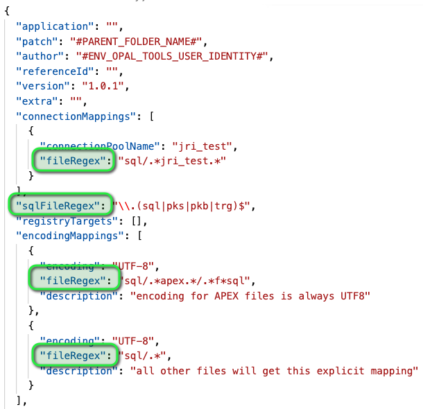

[//]: # (Infos about this file)
[//]: # (Markdown Syntax: https://guides.github.com/features/mastering-markdown/)

# Version 2.11.0 (release: ??.??.2025)

You can see the full list of issues with details in the [milestones page](https://github.com/daust/opal-tools/milestone/18?closed=1). 

## New features
  * #125: [Upgrade sqlcl libraries to 25.2](https://github.com/daust/opal-tools/issues/125)
  * #126: [Environment specific deployment of files](https://github.com/daust/opal-tools/issues/126)
  * #118: [Add version of OPAL TOOLS in validateConnections](https://github.com/daust/opal-tools/issues/118)

## Bug fixes
  * #124: [Export scripts for manual install - bug on Windows](https://github.com/daust/opal-tools/issues/124)

## Changed behaviour
  * *none* 

## Upgrade instructions

Upgrade from version 2.10.0 to 2.11.0

  * replace all files in the directory ``opal-tools/lib``, your existing environment will continue to work

## Deprecated features (still available but will go away eventually)
  * *none*

## Obsoleted features (no longer available)
  * *none*

## Known issues
  * Please check the current list of open issues: https://github.com/daust/opal-tools/issues. 

---

# Version 2.10.0 (release: 06.06.2025)

You can see the full list of issues with details in the [milestones page](https://github.com/daust/opal-tools/milestone/17?closed=1). 

## New features
  * see [milestones page](https://github.com/daust/opal-tools/milestone/17?closed=1)

## Bug fixes
  * see [milestones page](https://github.com/daust/opal-tools/milestone/17?closed=1)

## Changed behaviour
  * All custom export files in `opal-tools/export-templates` need to be changed to work with the newer JDBC layer [issue 122](https://github.com/daust/opal-tools/issues/122). 

## Upgrade instructions

Upgrade from version 2.9.0 to 2.10.0

  * replace all files in the directory ``opal-tools/lib``, your existing environment will continue to work
  * In an existing project, update all custom export files in `opal-tools/export-templates` to work with the newer JDBC layer [issue 122](https://github.com/daust/opal-tools/issues/122). 

## Deprecated features (still available but will go away eventually)
  * *none*

## Obsoleted features (no longer available)
  * *none*

## Known issues
  * Please check the current list of open issues: https://github.com/daust/opal-tools/issues. 

---

# Version 2.9.0 (release: 22.10.2023)

You can see the full list of issues with details in the [milestones page](https://github.com/daust/opal-tools/milestone/16?closed=1). 

## New features
  * see [milestones page](https://github.com/daust/opal-tools/milestone/16?closed=1)

## Bug fixes
  * see [milestones page](https://github.com/daust/opal-tools/milestone/16?closed=1)

## Changed behaviour
  * In an existing project, update the files ``conf/opal-export.conf`` and ``scripts/opal-export-pre-script.sql`` as described in [issue 111](https://github.com/daust/opal-tools/issues/111). 
  * Update files ``setProjectEnvironment.sh`` and ``setProjectEnvironment.cmd`` as described in [issue 114](https://github.com/daust/opal-tools/issues/114).

## Upgrade instructions

Upgrade from version 2.8.0 to 2.9.0

  * replace all files in the directory ``opal-tools/lib``, your existing environment will continue to work
  * In an existing project, update the files ``conf/opal-export.conf`` and ``scripts/opal-export-pre-script.sql`` as described in [issue 111](https://github.com/daust/opal-tools/issues/111). 
  * Update files ``setProjectEnvironment.sh`` and ``setProjectEnvironment.cmd`` as described in [issue 114](https://github.com/daust/opal-tools/issues/114).

## Deprecated features (still available but will go away eventually)
  * *none*

## Obsoleted features (no longer available)
  * *none*

## Known issues
  * Please check the current list of open issues: https://github.com/daust/opal-tools/issues . 

# Version 2.8.0 (release: 04.02.2022)

You can see the full list of issues with details in the [milestones page](https://github.com/daust/opal-tools/milestone/15?closed=1). 

## New features
  * see [milestones page](https://github.com/daust/opal-tools/milestone/15?closed=1)
  * the documentation has been updated and expanded significantly

## Bug fixes
  * see [milestones page](https://github.com/daust/opal-tools/milestone/15?closed=1)

## Changed behaviour
  * No behaviour has changed so that your existing environment will not break. You only have to replace the ``opal-tools/lib`` directory. 
  * Nevertheless, a number of changes will affect a new and clean installation which are very helpful. This is why we advise to do a new, clean install: 
    * scripts that should not be modified have been moved from ``opal-tools/bin`` to ``opal-tools/bin/internal``
    * **all** target directories for apex, rest, sql sources will have their own environment variable defined in the ``setProjectEnvironment.[cmd|sh]`` file. This is also picked up in all of the generated scripts making them even more transparent and easier to use
    * the source directory has been reorganized, a new level ``src`` has been introduced
    * also, the generated scripts will call their respective .sql files in the same directory which simplifies things a lot. 
    * you can use the parameter ``fileFilter`` instead of ``fileRegex`` for connection mappings as well as encoding mappings with a simplified syntax. This also simplifies cross-platform development for both MacOS/Linux and Windows. You can still use ``fileRegex``, your existing environment will not break. 

## Upgrade instructions

Upgrade from version 2.7.3 to 2.8.0

  * replace all files in the directory ``opal-tools/lib``, your existing environment will continue to work

## Deprecated features (still available but will go away eventually)
  * *none*

## Obsoleted features (no longer available)
  * *none*

## Known issues
  * Please check the current list of open issues: https://github.com/daust/opal-tools/issues . 

# Version 2.7.3 (release: 19.02.2021)

You can see the full list of issues with details in the [milestones page](https://github.com/daust/opal-tools/milestone/14?closed=1). 

## New features
  * see [milestones page](https://github.com/daust/opal-tools/milestone/14?closed=1)

## Bug fixes
  * see [milestones page](https://github.com/daust/opal-tools/milestone/14?closed=1)

## Changed behaviour
  * *none*

## Upgrade instructions
In order to upgrade from version 2.7.2 to 2.7.3 you only need to replace a single file in the /lib directory:

  * Remove opal-tools.2.7.2.jar from your /lib folder
  * Copy opal-tools.2.7.3.jar into your /lib folder  

In order to upgrade from version 2.6.0 to 2.7.3 you only need to replace the /lib directory:
  
  * Delete *all* files from /lib directory
  * Copy *all* files from the /lib directory of the distribution

## Deprecated features (still available but will go away eventually)
  * *none*

## Obsoleted features (no longer available)
  * *none*

## Known issues
  * Please check the current list of open issues: https://github.com/daust/opal-tools/issues . 

# Version 2.7.2 (release: 12.02.2021)

You can see the full list of issues with details in the [milestones page](https://github.com/daust/opal-tools/milestone/13?closed=1). 

## New features
  * see [milestones page](https://github.com/daust/opal-tools/milestone/13?closed=1)

## Bug fixes
  * see [milestones page](https://github.com/daust/opal-tools/milestone/13?closed=1)

## Changed behaviour
  * *none*

## Upgrade instructions
  In order to upgrade from version 2.6.0 to 2.7.2 you only need to replace the /lib directory:
  * Delete *all* files from /lib directory
  * Copy *all* files from the /lib directory of the distribution

## Deprecated features (still available but will go away eventually)
  * *none*

## Obsoleted features (no longer available)
  * *none*

## Known issues
  * Please check the current list of open issues: https://github.com/daust/opal-tools/issues . 

# Version 2.7.1 (release: 11.02.2021)

You can see the full list of issues with details in the [milestones page](https://github.com/daust/opal-tools/milestone/12?closed=1). 

## New features
  * see [milestones page](https://github.com/daust/opal-tools/milestone/12?closed=1)

## Bug fixes
  * see [milestones page](https://github.com/daust/opal-tools/milestone/12?closed=1)

## Changed behaviour
  * *none*

## Upgrade instructions
  In order to upgrade from version 2.6.0 to 2.7.1 you only need to replace the /lib directory:
  * Delete *all* files from /lib directory
  * Copy *all* files from the /lib directory of the distribution

## Deprecated features (still available but will go away eventually)
  * *none*

## Obsoleted features (no longer available)
  * *none*

## Known issues
  * Please check the current list of open issues: https://github.com/daust/opal-tools/issues . 

# Version 2.7.0 (release: 10.02.2021)

You can see the full list of issues with details in the [milestones page](https://github.com/daust/opal-tools/milestone/11?closed=1). 

## New features
  * see [milestones page](https://github.com/daust/opal-tools/milestone/11?closed=1)

## Bug fixes
  * see [milestones page](https://github.com/daust/opal-tools/milestone/11?closed=1)

## Changed behaviour
  * *none*

## Upgrade instructions
  In order to upgrade from version 2.6.0 to 2.7.0 you only need to replace the /lib directory:
  * Delete *all* files from /lib directory
  * Copy *all* files from the /lib directory of the distribution

## Deprecated features (still available but will go away eventually)
  * *none*

## Obsoleted features (no longer available)
  * *none*

## Known issues
  * Please check the current list of open issues: https://github.com/daust/opal-tools/issues . 

# Version 2.6.0 (release: 11.12.2020)

You can see the full list of issues with details in the [milestones page](https://github.com/daust/opal-tools/milestone/10?closed=1). 

## New features
  * see [milestones page](https://github.com/daust/opal-tools/milestone/10?closed=1)
  * changed names in documentation and the default in the setup routine, so that it matches the video and instructions:
    - ``scott hr`` => ``schema1 schema2``

## Bug fixes
  * see [milestones page](https://github.com/daust/opal-tools/milestone/10?closed=1)

## Changed behaviour
  * OPTIONAL: The naming of ``SourceFilesCopy.txt`` and ``SourceFilesReference.txt`` to ``SourceFilesCopy.conf`` and ``SourceFilesReference.conf``. These files are called from the shell scripts and passed as parameters. Your existing patches will continue to work. New releases will generate different patch-templates that will use these different filenames in the filesystem and call them automatically in the shell scripts. 
  * MANDATORY: In order to streamline the naming of properties, the following attributes have changed in the ``opal-installer.json`` file (else these properties will no longer be read):
    - ``matchRegEx => fileRegex``
    - ``sqlFileRegEx => sqlFileRegex``
    

## Deprecated features (still available but will go away eventually)
  * *none*

## Obsoleted features (no longer available)
  * *none*

## Known issues
  * Please check the current list of open issues: https://github.com/daust/opal-tools/issues . 

# Version 2.5.0 (release: 03.12.2020)

You can see the full list of issues with details in the [milestones page](https://github.com/daust/opal-tools/milestone/9?closed=1). 

## New features
  * see [milestones page](https://github.com/daust/opal-tools/milestone/9?closed=1)

## Bug fixes
  * see [milestones page](https://github.com/daust/opal-tools/milestone/9?closed=1)

## Changed behaviour
  * *none*

## Deprecated features (still available but will go away eventually)
  * *none*

## Obsoleted features (no longer available)
  * *none*

## Known issues
  * Please check the current list of open issues: https://github.com/daust/opal-tools/issues . 

# Version 2.4.1 (release: 30.11.2020)

You can see the full list of issues with details in the [milestones page](https://github.com/daust/opal-tools/milestone/8?closed=1). 

## New features
  * see [milestones page](https://github.com/daust/opal-tools/milestone/8?closed=1)

## Bug fixes
  * see [milestones page](https://github.com/daust/opal-tools/milestone/8?closed=1)

## Changed behaviour
  * the file ``PatchFiles.txt`` is split into two files: 
    - ``SourceFilesCopy.conf`` (picked up by 1.copy-source-files)
    - ``SourceFilesReference.conf`` (picked up by 2.validate and 3.install)
  * the script ``opal-tools/bin/opal-copy-patch-files.sh|cmd`` is renamed to ``opal-tools/bin/opal-copy-source-files.sh|cmd``
  * the patch script ``1.copy-patch-files.sh|cmd`` is renamed to ``1.copy-source-files.sh|cmd``
  * the class ``CopyPatchFilesMain`` was renamed to ``CopySourceFilesMain`` and is updated in ``opal-tools/bin/opal-copy-source-files.sh|cmd``
  * the patch ``scripts 1.copy, 2.validate, 3.install`` have all been modified, because the command line switches have been renamed: 
    - ``--source-list-file``
    - ``--source-dir``
    - ``--target-dir``
  * the file ``opal-tools/bin/initialize-patch.sh|cmd`` is modified, the command line switches have changed for the copy command: 
    - ``--source-dir``
    - ``--target-dir``

## Deprecated features (still available but will go away eventually)
  * *none*

## Obsoleted features (no longer available)
  * *none*

## Known issues
  * Please check the current list of open issues: https://github.com/daust/opal-tools/issues . 

# Version 2.4.0 (release: 29.11.2020)

You can see the full list of issues with details in the [milestones page](https://github.com/daust/opal-tools/milestone/7?closed=1). 

## New features
  * see [milestones page](https://github.com/daust/opal-tools/milestone/7?closed=1)

## Bug fixes
  * see [milestones page](https://github.com/daust/opal-tools/milestone/7?closed=1)

## Changed behaviour
  * the file ``PatchFiles.txt`` is split into two files: 
    - ``SourceFilesCopy.conf`` (picked up by 1.copy-source-files)
    - ``SourceFilesReference.conf`` (picked up by 2.validate and 3.install)
  * the script ``opal-tools/bin/opal-copy-patch-files.sh|cmd`` is renamed to ``opal-tools/bin/opal-copy-source-files.sh|cmd``
  * the patch script ``1.copy-patch-files.sh|cmd`` is renamed to ``1.copy-source-files.sh|cmd``

## Deprecated features (still available but will go away eventually)
  * *none*

## Obsoleted features (no longer available)
  * *none*

## Known issues
  * Please check the current list of open issues: https://github.com/daust/opal-tools/issues . 

# Version 2.3.0 (release: 26.11.2020)

You can see the full list of issues with details in the [milestones page](https://github.com/daust/opal-tools/milestone/6?closed=1). 

## New features
  * see [milestones page](https://github.com/daust/opal-tools/milestone/6?closed=1)

## Bug fixes
  * see [milestones page](https://github.com/daust/opal-tools/milestone/6?closed=1)

## Changed behaviour
  * *none*

## Deprecated features (still available but will go away eventually)
  * *none*

## Obsoleted features (no longer available)
  * *none*

## Known issues
  * Please check the current list of open issues: https://github.com/daust/opal-tools/issues . 

# Version 2.2.0 (release: 24.11.2020)

You can see the full list of issues with details in the [milestones page](https://github.com/daust/opal-tools/milestone/5?closed=1). 

## New features
  * see [milestones page](https://github.com/daust/opal-tools/milestone/5?closed=1)

## Bug fixes
  * see [milestones page](https://github.com/daust/opal-tools/milestone/5?closed=1)

## Changed behaviour
  * *none*

## Deprecated features (still available but will go away eventually)
  * *none*

## Obsoleted features (no longer available)
  * *none*

## Known issues
  * Please check the current list of open issues: https://github.com/daust/opal-tools/issues . 

# Version 2.1.0 (pre-release: 16.11.2020)

You can see the full list of issues with details in the [milestones page](https://github.com/daust/opal-tools/milestone/4?closed=1). 

## New features
  * see [milestones page](https://github.com/daust/opal-tools/milestone/4?closed=1)

## Bug fixes
  * see [milestones page](https://github.com/daust/opal-tools/milestone/4?closed=1)

## Changed behaviour
  * *none*

## Deprecated features (still available but will go away eventually)
  * *none*

## Obsoleted features (no longer available)
  * *none*

## Known issues
  * Please check the current list of open issues: https://github.com/daust/opal-tools/issues . 

# Version 2.0.0 (pre-release: 12.11.2020)

You can see the full list of issues with details in the [milestones page](https://github.com/daust/opal-tools/milestone/3?closed=1). 

## New features
  * see [milestones page](https://github.com/daust/opal-tools/milestone/3?closed=1)

## Bug fixes
  * see [milestones page](https://github.com/daust/opal-tools/milestone/3?closed=1)

## Changed behaviour
  * Command line switches are new and the old positional parameters have been removed. 
  * Thus, all batch files will break. 

## Deprecated features (still available but will go away eventually)
  * *none*

## Obsoleted features (no longer available)
  * Command line switches are new and the old positional parameters have been removed. 
  * Thus, all batch files will break. 

## Known issues
  * Please check the current list of open issues: https://github.com/daust/opal-tools/issues . 

# Version 1.1.2 (pre-release: 06.11.2020)

You can see the full list of issues with details in the [milestones page](https://github.com/daust/opal-tools/milestone/2?closed=1). 

## New features
  * see [milestones page](https://github.com/daust/opal-tools/milestone/2?closed=1)

## Bug fixes
  * see [milestones page](https://github.com/daust/opal-tools/milestone/2?closed=1)

## Changed behaviour
  * *none*

## Deprecated features (still available but will go away eventually)
  * *none*

## Obsoleted features (no longer available)
  * *none*

## Known issues
  * Please check the current list of open issues: https://github.com/daust/opal-tools/issues . 

